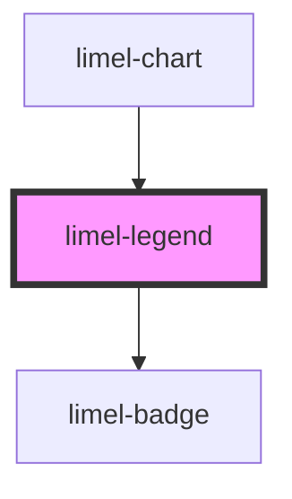

# limel-legend

<!-- Auto Generated Below -->

## Properties

| Property      | Attribute | Description | Type                                                      | Default               |
| ------------- | --------- | ----------- | --------------------------------------------------------- | --------------------- |
| `getItemText` | --        |             | `(item: ChartItem<number \| [number, number]>) => string` | `(item) => item.text` |
| `hiddenItems` | --        |             | `Set<string>`                                             | `undefined`           |
| `items`       | --        |             | `ChartItem<number \| [number, number]>[]`                 | `undefined`           |

## Events

| Event         | Description | Type                                                 |
| ------------- | ----------- | ---------------------------------------------------- |
| `legendClick` |             | `CustomEvent<ChartItem<number \| [number, number]>>` |

## Dependencies

### Used by

 - [limel-chart](.)

### Depends on

- [limel-badge](../badge)

### Graph

----------------------------------------------

*Built with [StencilJS](https://stenciljs.com/)*
