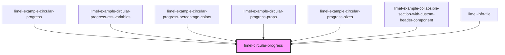

# limel-circular-progress

<!-- Auto Generated Below -->

## Overview

The circular progress component can be used to visualize the curent state of
a progress in a scale; for example percentage of completion of a task.

Its compact UI makes the component suitable when there is not enough screen
space available to visualise such information.

This component allows you to define your scale, from `0` to a desired
`maxValue`; and also lets you chose a proper `suffix` for your scale.

:::note
The component will round up the value when it is displayed, and only shows
one decimal digit.
It also abbreviates large numbers. For example 1234 will be displayed as 1.2k.
Of course such numbers, if bigger than `maxValue` will be visualized as a
full progress.
:::

## Properties

| Property                  | Attribute                   | Description                                                                                                                                                | Type                                                       | Default     |
| ------------------------- | --------------------------- | ---------------------------------------------------------------------------------------------------------------------------------------------------------- | ---------------------------------------------------------- | ----------- |
| `displayPercentageColors` | `display-percentage-colors` | When set to `true`, makes the filled section showing the percentage colorful. Colors change with intervals of 10%.                                         | `boolean`                                                  | `false`     |
| `maxValue`                | `max-value`                 | The maximum value within the scale that the progress bar should visualize. Defaults to `100`.                                                              | `number`                                                   | `PERCENT`   |
| `prefix`                  | `prefix`                    | The prefix which is displayed before the `value`, must be a few characters characters long.                                                                | `string`                                                   | `null`      |
| `size`                    | `size`                      | Determines the visual size of the visualization from a preset size. This property can override the `--circular-progress-size` variable if it is specified. | `"large" \| "medium" \| "small" \| "x-large" \| "x-small"` | `undefined` |
| `suffix`                  | `suffix`                    | The suffix which is displayed after the `value`, must be one or two characters long. Defaults to `%`                                                       | `string`                                                   | `'%'`       |
| `value`                   | `value`                     | The value of the progress bar.                                                                                                                             | `number`                                                   | `0`         |

## Dependencies

### Used by

 - [limel-example-circular-progress](examples)
 - [limel-example-circular-progress-css-variables](examples)
 - [limel-example-circular-progress-percentage-colors](examples)
 - [limel-example-circular-progress-props](examples)
 - [limel-example-circular-progress-sizes](examples)
 - [limel-example-collapsible-section-with-custom-header-component](../collapsible-section/examples)
 - [limel-info-tile](../info-tile)

### Graph

----------------------------------------------

*Built with [StencilJS](https://stenciljs.com/)*
