# limel-markdown

<!-- Auto Generated Below -->

## Overview

The Markdown component receives markdown syntax
and renders it as HTML.

## Properties

| Property                | Attribute                 | Description                                                                                                                                                                                                       | Type                        | Default                          |
| ----------------------- | ------------------------- | ----------------------------------------------------------------------------------------------------------------------------------------------------------------------------------------------------------------- | --------------------------- | -------------------------------- |
| `lazyLoadImages`        | `lazy-load-images`        | Enable lazy loading for images                                                                                                                                                                                    | `boolean`                   | `false`                          |
| `removeEmptyParagraphs` | `remove-empty-paragraphs` | Set to `false` to preserve empty paragraphs before rendering. Empty paragraphs are paragraphs that do not contain any meaningful content (text, images, etc.), or only contain whitespace (` ` or `&nbsp;`). | `boolean`                   | `true`                           |
| `value`                 | `value`                   | The input text. Treated as GitHub Flavored Markdown, with the addition that any included HTML will be parsed and rendered as HTML, rather than as text.                                                           | `string`                    | `''`                             |
| `whitelist`             | --                        | Whitelisted html elements.  Any custom element added here will not be sanitized and thus rendered. Can also be set via `limel-config`. Setting this property will override the global config.                     | `CustomElementDefinition[]` | `globalConfig.markdownWhitelist` |

## Dependencies

### Used by

 - [limel-card](../card)
 - [limel-example-do-do-not](../../examples)
 - [limel-example-markdown-blockquotes](examples)
 - [limel-example-markdown-code](examples)
 - [limel-example-markdown-composite](examples)
 - [limel-example-markdown-custom-component](examples)
 - [limel-example-markdown-emphasis](examples)
 - [limel-example-markdown-footnotes](examples)
 - [limel-example-markdown-headings](examples)
 - [limel-example-markdown-horizontal-rule](examples)
 - [limel-example-markdown-html](examples)
 - [limel-example-markdown-images](examples)
 - [limel-example-markdown-keys](examples)
 - [limel-example-markdown-links](examples)
 - [limel-example-markdown-lists](examples)
 - [limel-example-markdown-remove-empty-paragraphs](examples)
 - [limel-example-markdown-tables](examples)
 - [limel-example-popover-trigger-interaction](../popover/examples)
 - [limel-help-content](../help)
 - [limel-showcase-card](../../examples/whats-new)
 - [limel-text-editor](../text-editor)

### Graph

```mermaid
graph TD;
  limel-card --> limel-markdown
  limel-example-do-do-not --> limel-markdown
  limel-example-markdown-blockquotes --> limel-markdown
  limel-example-markdown-code --> limel-markdown
  limel-example-markdown-composite --> limel-markdown
  limel-example-markdown-custom-component --> limel-markdown
  limel-example-markdown-emphasis --> limel-markdown
  limel-example-markdown-footnotes --> limel-markdown
  limel-example-markdown-headings --> limel-markdown
  limel-example-markdown-horizontal-rule --> limel-markdown
  limel-example-markdown-html --> limel-markdown
  limel-example-markdown-images --> limel-markdown
  limel-example-markdown-keys --> limel-markdown
  limel-example-markdown-links --> limel-markdown
  limel-example-markdown-lists --> limel-markdown
  limel-example-markdown-remove-empty-paragraphs --> limel-markdown
  limel-example-markdown-tables --> limel-markdown
  limel-example-popover-trigger-interaction --> limel-markdown
  limel-help-content --> limel-markdown
  limel-showcase-card --> limel-markdown
  limel-text-editor --> limel-markdown
  style limel-markdown fill:#f9f,stroke:#333,stroke-width:4px
```

----------------------------------------------

*Built with [StencilJS](https://stenciljs.com/)*
