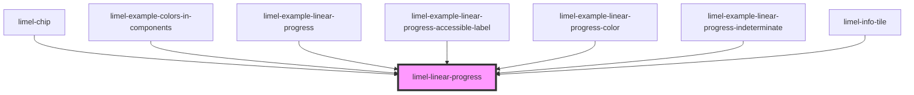

# limel-linear-progress

<!-- Auto Generated Below -->

## Overview

The linear progress component can be used to visualize the current state of a progress in a scale;
for example percentage of completion of a task.

## Properties

| Property          | Attribute          | Description                                                                                                                                                                    | Type                                                                   | Default     |
| ----------------- | ------------------ | ------------------------------------------------------------------------------------------------------------------------------------------------------------------------------ | ---------------------------------------------------------------------- | ----------- |
| `accessibleLabel` | `accessible-label` | A label used to describe the purpose of the element to users of assistive technologies, like screen readers. If not provided, the generic word of "Progress bar" will be used. | `string`                                                               | `undefined` |
| `indeterminate`   | `indeterminate`    | Puts the progress bar in an indeterminate state                                                                                                                                | `boolean`                                                              | `false`     |
| `language`        | `language`         | Defines the language for translations. Will translate the translatable strings on the components.                                                                              | `"da" \| "de" \| "en" \| "fi" \| "fr" \| "nb" \| "nl" \| "no" \| "sv"` | `'en'`      |
| `value`           | `value`            | The value of the progress bar. Should be between `0` and `1`.                                                                                                                  | `number`                                                               | `0`         |

## Dependencies

### Used by

 - [limel-chip](../chip)
 - [limel-example-colors-in-components](../../design-guidelines/color-system/examples)
 - [limel-example-linear-progress](examples)
 - [limel-example-linear-progress-accessible-label](examples)
 - [limel-example-linear-progress-color](examples)
 - [limel-example-linear-progress-indeterminate](examples)
 - [limel-info-tile](../info-tile)

### Graph

----------------------------------------------

*Built with [StencilJS](https://stenciljs.com/)*
