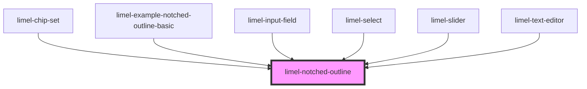

# limel-notched-outline

<!-- Auto Generated Below -->

## Overview

This is a private component, used to render a notched outline
around all input elements that can have a floating label.
Inspired by Material Design's styles for input fields.
We use it in various components to unify styles and avoid
repeating code.

:::note
The component has `shadow: false`. This is to improve performance,
and ensure that its internal elements are considered as internal parts
of the consumer's DOM. This way, the value `for` in `<label for="id-of-input-element">`
would be correctly associated with the input element's `id`, in the consumer component.
:::

## Properties

| Property           | Attribute            | Description                                                                                                                                                                                                                        | Type      | Default     |
| ------------------ | -------------------- | ---------------------------------------------------------------------------------------------------------------------------------------------------------------------------------------------------------------------------------- | --------- | ----------- |
| `disabled`         | `disabled`           | Set to `true` to indicate that the input element is disabled. This applies proper visual styles, such as making the outlines and the label transparent.                                                                            | `boolean` | `false`     |
| `hasFloatingLabel` | `has-floating-label` | Set to `true` when the consumer element needs to render the label above the input element, despite existence of a `value`. For example in the `text-editor` or `limel-select`, where the default layout requires a floating label. | `boolean` | `false`     |
| `hasLeadingIcon`   | `has-leading-icon`   | Set to `true` when the consumer element displays a leading icon. This applies proper visual styles, such as rendering the label correctly placed beside the leading icon.                                                          | `boolean` | `false`     |
| `hasValue`         | `has-value`          | Set to `true` when the user has entered a value for the input element, shrinking the label in size, and visually rendering it above the entered value.                                                                             | `boolean` | `false`     |
| `invalid`          | `invalid`            | Set to `true` to indicate that the current value of the input element is invalid. This applies proper visual styles, such as making the outlines red.                                                                              | `boolean` | `false`     |
| `label`            | `label`              | Label to display for the input element. :::important Note that the input element of the consumer component will be labeled by this label, using the `labelId` prop. :::                                                            | `string`  | `undefined` |
| `labelId`          | `label-id`           | The `id` of the input element which should be labeled by the provided label.                                                                                                                                                       | `string`  | `undefined` |
| `readonly`         | `readonly`           | Set to `true` when the input element is readonly. This applies proper visual styles, such as making the outline transparent.                                                                                                       | `boolean` | `false`     |
| `required`         | `required`           | Set to `true` when the input element is required. This applies proper visual styles, such as inclusion of an asterisk beside the label.                                                                                            | `boolean` | `false`     |

## Dependencies

### Used by

 - [limel-chip-set](../chip-set)
 - [limel-example-notched-outline-basic](examples)
 - [limel-input-field](../input-field)
 - [limel-select](../select)
 - [limel-slider](../slider)
 - [limel-text-editor](../text-editor)

### Graph

----------------------------------------------

*Built with [StencilJS](https://stenciljs.com/)*
