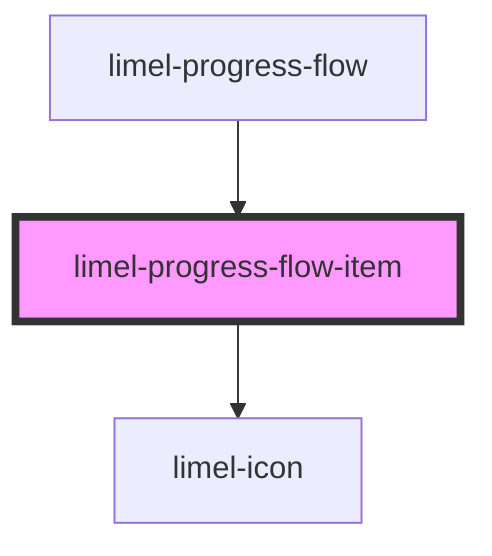

# limel-progress-flow-item

<!-- Auto Generated Below -->

## Properties

| Property      | Attribute      | Description                              | Type       | Default |
| ------------- | -------------- | ---------------------------------------- | ---------- | ------- |
| `currentStep` | `current-step` | True for current step                    | `boolean`  | `false` |
| `disabled`    | `disabled`     | True if the flow item should be disabled | `boolean`  | `false` |
| `item`        | --             | The flow item that should be rendered    | `FlowItem` | `null`  |
| `readonly`    | `readonly`     | True if the flow item should be readonly | `boolean`  | `false` |

## Events

| Event      | Description                          | Type                |
| ---------- | ------------------------------------ | ------------------- |
| `interact` | Fired when clicking on the flow item | `CustomEvent<void>` |

## Dependencies

### Used by

 - [limel-progress-flow](..)

### Depends on

- [limel-icon](../../icon)

### Graph

----------------------------------------------

*Built with [StencilJS](https://stenciljs.com/)*
