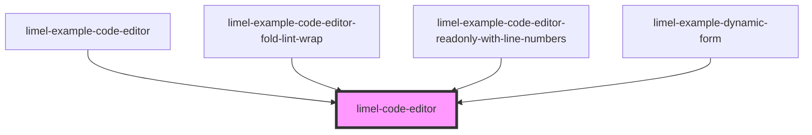

# limel-code-editor

<!-- Auto Generated Below -->

## Properties

| Property       | Attribute       | Description                                              | Type                                                                    | Default     |
| -------------- | --------------- | -------------------------------------------------------- | ----------------------------------------------------------------------- | ----------- |
| `colorScheme`  | `color-scheme`  | Select color scheme for the editor                       | `"auto" \| "dark" \| "light"`                                           | `'auto'`    |
| `fold`         | `fold`          | Allows the user to fold code                             | `boolean`                                                               | `false`     |
| `language`     | `language`      | The language of the code                                 | `"css" \| "html" \| "javascript" \| "jinja2" \| "json" \| "typescript"` | `undefined` |
| `lineNumbers`  | `line-numbers`  | Displays line numbers in the editor                      | `boolean`                                                               | `false`     |
| `lineWrapping` | `line-wrapping` | Wraps long lines instead of showing horizontal scrollbar | `boolean`                                                               | `false`     |
| `lint`         | `lint`          | Enables linting of JSON content                          | `boolean`                                                               | `false`     |
| `readonly`     | `readonly`      | Disables editing of the editor content                   | `boolean`                                                               | `false`     |
| `value`        | `value`         | The code to be rendered                                  | `string`                                                                | `''`        |

## Events

| Event    | Description                                                                               | Type                  |
| -------- | ----------------------------------------------------------------------------------------- | --------------------- |
| `change` | Emitted when the code has changed. Will only be emitted when the code area has lost focus | `CustomEvent<string>` |

## Dependencies

### Used by

 - [limel-example-code-editor](examples)
 - [limel-example-code-editor-fold-lint-wrap](examples)
 - [limel-example-code-editor-readonly-with-line-numbers](examples)
 - [limel-example-dynamic-form](../form/examples)

### Graph

----------------------------------------------

*Built with [StencilJS](https://stenciljs.com/)*
