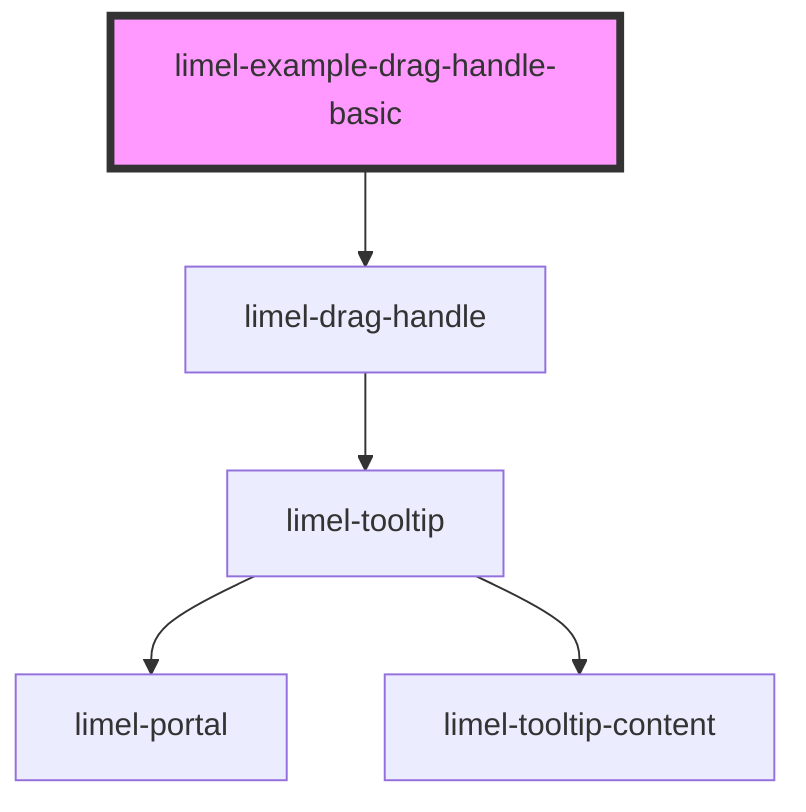

# limel-example-drag-handle-basic

<!-- Auto Generated Below -->

## Overview

Basic example
The component is designed to be working both by mouse, pointer devices, and touch.
However, to ensure accessibility, it also provides keyboard support.

When the component is focused using the keyboard, a helper label will appear
in its tooltip, indicating how to use the drag handle with keyboard controls.

## Dependencies

### Depends on

- [limel-drag-handle](..)

### Graph

----------------------------------------------

*Built with [StencilJS](https://stenciljs.com/)*
