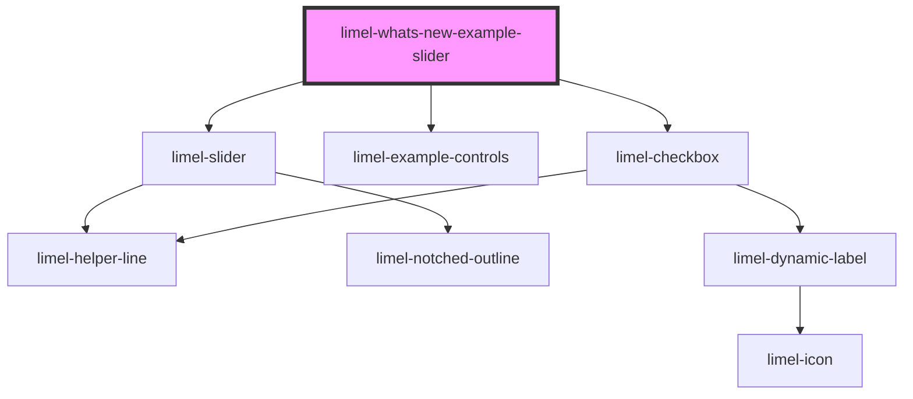

# limel-whats-new-example-slider

<!-- Auto Generated Below -->

## Dependencies

### Depends on

- [limel-slider](../../../components/slider)
- [limel-example-controls](../..)
- [limel-checkbox](../../../components/checkbox)

### Graph

----------------------------------------------

*Built with [StencilJS](https://stenciljs.com/)*
