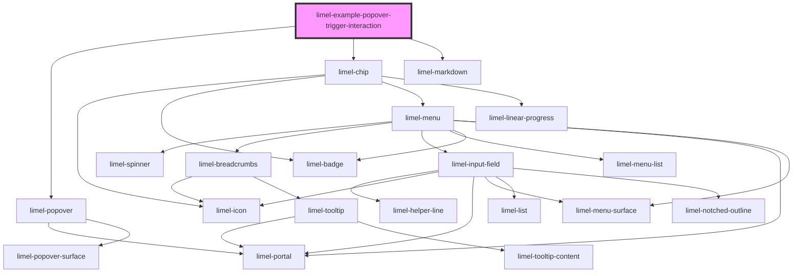

# limel-example-popover-trigger-interaction

<!-- Auto Generated Below -->

## Overview

Trigger Interaction for Popovers

Popovers are typically triggered by a click event, but they can also be triggered
by hover or focus events. This approach is especially useful when the click event
is reserved for other interactions, such as navigating to another page or activating
a different function.

Triggering a popover with hover or focus is useful when clicking the trigger element
is required for actions like navigation, while still providing contextual information
or options through the popover.

:::important
Key considerations when using hover and focus triggers:

**Delayed Popover Opening**:
Hovering or focusing on the trigger element should not immediately open the popover.
Always introduce a reasonable delay before opening the popover to prevent accidental activation.
This prevents an annoying user experience where the popover opens as the user moves
their cursor across the UI. It's especially important in UIs with multiple trigger elements.

**Popover Should Remain Open**:
The popover should remain open even if the user moves the cursor away from
the trigger element or navigates away with the keyboard.
This allows the user to interact with the popover content without it closing unexpectedly.

**Touchscreen Accessibility**:
Consider the experience for users on touchscreen devices. Hover interactions might not be available,
so ensure the design is accessible to them.

**Provide Proper Cues**:
Provide clear visual indicators, or use accessible attributes like `title` or `aria-label`,
to signal that the trigger element is interactive when hovered or focused.
This ensures that users understand they can interact with the element even without clicking.

**Low discoverability**:
Remember that such interaction are not easily discovered by the end-users.
Therefore, you should avoid having any critical functionality to be hidden
behind such interactions, and only use it as supplementary means of enriching
the user experience.
:::

## Dependencies

### Depends on

- [limel-popover](..)
- [limel-chip](../../chip)
- [limel-markdown](../../markdown)

### Graph

----------------------------------------------

*Built with [StencilJS](https://stenciljs.com/)*
