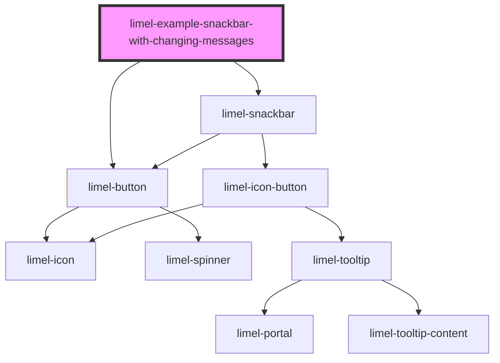

# limel-example-snackbar-with-changing-messages

<!-- Auto Generated Below -->

## Overview

With changing messages

## Dependencies

### Depends on

- [limel-button](../../button)
- [limel-snackbar](..)

### Graph

----------------------------------------------

*Built with [StencilJS](https://stenciljs.com/)*
