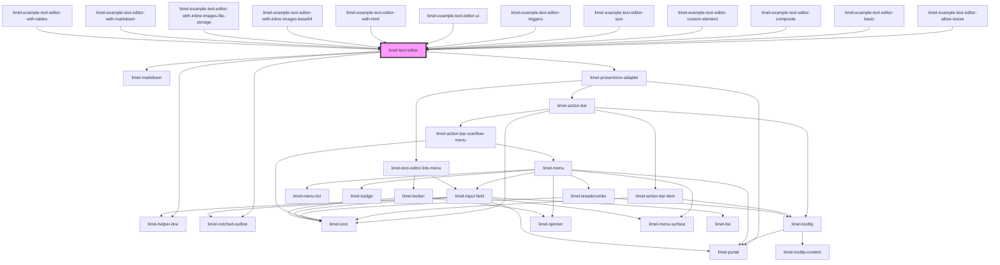

# limel-text-editor

<!-- Auto Generated Below -->

## Overview

A rich text editor that offers a rich text editing experience with markdown support,
in the sense that you can easily type markdown syntax and see the rendered
result as rich text in real-time. For instance, you can type `# Hello, world!`
and see it directly turning to a heading 1 (an `<h1>` HTML element).

Naturally, you can use standard keyboard hotkeys such as <kbd>Ctrl</kbd> + <kbd>B</kbd>
to toggle bold text, <kbd>Ctrl</kbd> + <kbd>I</kbd> to toggle italic text, and so on.

## Properties

| Property         | Attribute      | Description                                                                                                                                                                                                                                                                                                                                                                                                                                                                                                                                                                                                                     | Type                                                                   | Default      |
| ---------------- | -------------- | ------------------------------------------------------------------------------------------------------------------------------------------------------------------------------------------------------------------------------------------------------------------------------------------------------------------------------------------------------------------------------------------------------------------------------------------------------------------------------------------------------------------------------------------------------------------------------------------------------------------------------- | ---------------------------------------------------------------------- | ------------ |
| `allowResize`    | `allow-resize` | Set to `true` to allow the user to vertically resize the editor. Set to `false` to disable the resize functionality.                                                                                                                                                                                                                                                                                                                                                                                                                                                                                                            | `boolean`                                                              | `true`       |
| `contentType`    | `content-type` | The type of content that the editor should handle and emit, defaults to `markdown`  Assumed to be set only once, so not reactive to changes                                                                                                                                                                                                                                                                                                                                                                                                                                                                                     | `"html" \| "markdown"`                                                 | `'markdown'` |
| `customElements` | --             | A list of custom elements  Any `CustomElement` that should be used inside the text editor needs to be defined here.                                                                                                                                                                                                                                                                                                                                                                                                                                                                                                             | `CustomElementDefinition[]`                                            | `[]`         |
| `disabled`       | `disabled`     | Set to `true` to disable the field. Use `disabled` to indicate that the field can normally be interacted with, but is currently disabled. This tells the user that if certain requirements are met, the field may become enabled again.                                                                                                                                                                                                                                                                                                                                                                                         | `boolean`                                                              | `false`      |
| `helperText`     | `helper-text`  | Optional helper text to display below the input field when it has focus                                                                                                                                                                                                                                                                                                                                                                                                                                                                                                                                                         | `string`                                                               | `undefined`  |
| `invalid`        | `invalid`      | Set to `true` to indicate that the current value of the editor is invalid.                                                                                                                                                                                                                                                                                                                                                                                                                                                                                                                                                      | `boolean`                                                              | `false`      |
| `label`          | `label`        | The label of the editor                                                                                                                                                                                                                                                                                                                                                                                                                                                                                                                                                                                                         | `string`                                                               | `undefined`  |
| `language`       | `language`     | Defines the language for translations.                                                                                                                                                                                                                                                                                                                                                                                                                                                                                                                                                                                          | `"da" \| "de" \| "en" \| "fi" \| "fr" \| "nb" \| "nl" \| "no" \| "sv"` | `'en'`       |
| `placeholder`    | `placeholder`  | The placeholder text shown inside the input field, when the field is empty.                                                                                                                                                                                                                                                                                                                                                                                                                                                                                                                                                     | `string`                                                               | `undefined`  |
| `readonly`       | `readonly`     | Set to `true` to make the component read-only. Use `readonly` when the field is only there to present the data it holds, and will not become possible for the current user to edit. :::note Consider that it might be better to use `limel-markdown` instead of `limel-text-editor` when the goal is visualizing data. :::                                                                                                                                                                                                                                                                                                      | `boolean`                                                              | `false`      |
| `required`       | `required`     | Set to `true` to indicate that the field is required.  :::important An empty but required field is not automatically considered invalid. You must make sure to check the validity of the field on your own, and properly handle the `invalid` state. :::                                                                                                                                                                                                                                                                                                                                                                        | `boolean`                                                              | `false`      |
| `triggers`       | --             | A set of trigger characters  Defining a character here will enable trigger events to be sent if the character is detected in the editor.                                                                                                                                                                                                                                                                                                                                                                                                                                                                                        | `TriggerCharacter[]`                                                   | `[]`         |
| `ui`             | `ui`           | Specifies the visual appearance of the editor.  - `standard`: The default editor appearance with a full toolbar and    standard layout. - `minimal`: A compact editor appearance, ideal for limited space    scenarios such as mobile devices. In this mode, the toolbar is hidden    until the editor is focused. - `no-toolbar`: A basic textarea appearance without any text styling toolbar.    This mode is suitable for scenarios where you want to provide a simple    text input without any visible formatting options; but still provide    support for markdown syntax and rich text, using hotkeys or when pasting. | `"minimal" \| "no-toolbar" \| "standard"`                              | `'standard'` |
| `value`          | `value`        | Description of the text inside the editor as markdown                                                                                                                                                                                                                                                                                                                                                                                                                                                                                                                                                                           | `string`                                                               | `undefined`  |

## Events

| Event            | Description                                                                                                                                                                                                                                     | Type                              |
| ---------------- | ----------------------------------------------------------------------------------------------------------------------------------------------------------------------------------------------------------------------------------------------- | --------------------------------- |
| `change`         | Dispatched when a change is made to the editor                                                                                                                                                                                                  | `CustomEvent<string>`             |
| `imagePasted`    | Dispatched when a image is pasted into the editor                                                                                                                                                                                               | `CustomEvent<ImageInserter>`      |
| `imageRemoved`   | **[DEPRECATED]** - This event is deprecated and will be removed in a future version. Use the `metadataChange` event instead to track image removals.  Dispatched when a image is removed from the editor | `CustomEvent<EditorImage>`        |
| `metadataChange` | Dispatched when the metadata of the editor changes                                                                                                                                                                                              | `CustomEvent<EditorMetadata>`     |
| `triggerChange`  | Dispatched if a input is changed during an active trigger.                                                                                                                                                                                      | `CustomEvent<TriggerEventDetail>` |
| `triggerStart`   | Dispatched if a trigger character is detected.                                                                                                                                                                                                  | `CustomEvent<TriggerEventDetail>` |
| `triggerStop`    | Dispatched if a trigger session is ended. That is if the selection goes outside the trigger input or if something is inserted using the supplied `TextEditor` insert function.                                                                  | `CustomEvent<TriggerEventDetail>` |

## Dependencies

### Used by

 - [limel-example-text-editor-allow-resize](examples)
 - [limel-example-text-editor-basic](examples)
 - [limel-example-text-editor-composite](examples)
 - [limel-example-text-editor-custom-element](examples)
 - [limel-example-text-editor-size](examples)
 - [limel-example-text-editor-triggers](examples)
 - [limel-example-text-editor-ui](examples)
 - [limel-example-text-editor-with-html](examples)
 - [limel-example-text-editor-with-inline-images-base64](examples)
 - [limel-example-text-editor-with-inline-images-file-storage](examples)
 - [limel-example-text-editor-with-markdown](examples)
 - [limel-example-text-editor-with-tables](examples)

### Depends on

- [limel-helper-line](../helper-line)
- [limel-notched-outline](../notched-outline)
- [limel-markdown](../markdown)
- [limel-prosemirror-adapter](prosemirror-adapter)

### Graph

----------------------------------------------

*Built with [StencilJS](https://stenciljs.com/)*
