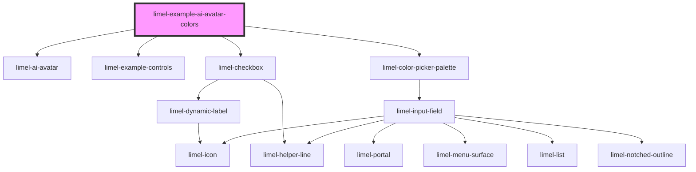

# limel-example-ai-avatar-colors

<!-- Auto Generated Below -->

## Overview

With background colors
To render better, the AI avatar needs to be placed on a colored background.

## Dependencies

### Depends on

- [limel-ai-avatar](..)
- [limel-example-controls](../../../examples)
- [limel-checkbox](../../checkbox)
- [limel-color-picker-palette](../../color-picker)

### Graph

----------------------------------------------

*Built with [StencilJS](https://stenciljs.com/)*
