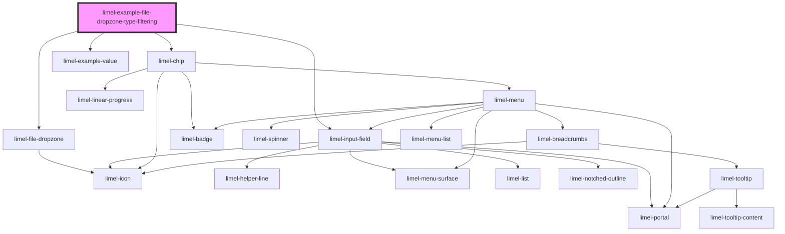

# limel-example-file-dropzone-type-filtering

<!-- Auto Generated Below -->

## Overview

File type filtering
The component allows you to specify the types of files that the dropzone will accept.
By default, it accepts all file types (`*`).

For media files, it is possible to specify any format, using:
`audio/*`, `video/*`, `image/*`.

Additionally, you can use unique file type specifiers, such as:
`.jpg`, or `.pdf`; or use a comma-separated list of file extensions or MIME types,
for instance: `image/png, image/jpeg` or `.png, .jpg, .jpeg`.

Read more about
[HTML attribute: accept](https://developer.mozilla.org/en-US/docs/Web/HTML/Attributes/accept)

## Dependencies

### Depends on

- [limel-file-dropzone](..)
- [limel-input-field](../../input-field)
- [limel-chip](../../chip)
- [limel-example-value](../../../examples)

### Graph

----------------------------------------------

*Built with [StencilJS](https://stenciljs.com/)*
