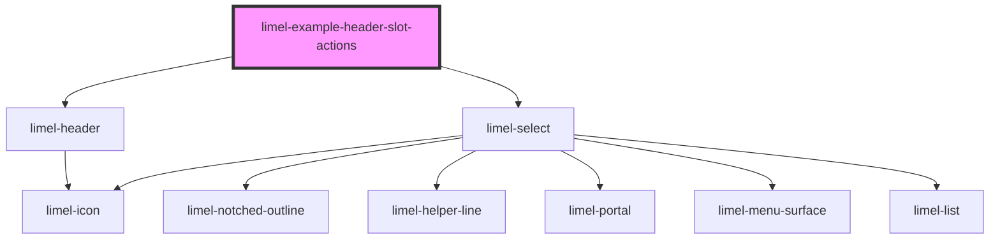

# limel-example-header-slot-actions

<!-- Auto Generated Below -->

## Overview

Using the "actions" slot
The component offers a place for including custom actions, or
any other component that you want to include in the header.
To include any component in the `actions` area,
you can simply use the `slot="actions"` attribute.

:::note
In small containers when having the default layout, the `actions` area
wins the battle of limited space! It means, if you have a very wide
component in the actions area, it will never shrink in size, and instead
forces the headings to truncate.
:::

## Dependencies

### Depends on

- [limel-header](..)
- [limel-select](../../select)

### Graph

----------------------------------------------

*Built with [StencilJS](https://stenciljs.com/)*
