# limel-chip

<!-- Auto Generated Below -->

## Overview

Chips and buttons are both interactive elements in UI design,
but they serve different purposes and are used in different contexts.

:::warning
Do not use the chip component carelessly, as an alternative for
[`limel-button`](#/component/limel-button/) in the UI design!

**Buttons:**
Buttons are used to trigger actions. They are typically used to
submit forms, open dialogs, initiate a process, or perform any action
that changes the state of the application.
Buttons' labels usually contain action words, in other words, the labels is
a _verb in imperative mood_ such as "Submit" or "Delete".
Buttons are placed in areas where it's clear they will initiate
an action when clicked.

**Chips:**
Chips however are elements which may look like buttons, but they are
representing choices, filters, or tags, in a small block
or clearly bundled into a group. Chips are rarely used alone in the
user interface.
They are often used in a so called "chip-set", or placed together in
a section of the UI, where the user can expect more than one chip to be present.

For example, a chip may represent a filter in a filter bar, or a tag in a tag list,
or an item in a shopping list.
Clicking a chip can also trigger an action, for example toggling a filter ON or OFF,
or opening a page with all posts tagged with the tag represented by the chip,
or navigating to a page with more information about the item in the shopping list.
:::

## Properties

| Property     | Attribute    | Description                                                                                                                                                                                                               | Type                                                                   | Default               |
| ------------ | ------------ | ------------------------------------------------------------------------------------------------------------------------------------------------------------------------------------------------------------------------- | ---------------------------------------------------------------------- | --------------------- |
| `badge`      | `badge`      | The value of the badge, displayed on the chip.                                                                                                                                                                            | `number \| string`                                                     | `undefined`           |
| `disabled`   | `disabled`   | Set to `true` to disable the chip.                                                                                                                                                                                        | `boolean`                                                              | `false`               |
| `icon`       | `icon`       | Icon of the chip.                                                                                                                                                                                                         | `Icon \| string`                                                       | `undefined`           |
| `identifier` | `identifier` | Identifier for the chip. Must be unique.                                                                                                                                                                                  | `number \| string`                                                     | `crypto.randomUUID()` |
| `image`      | --           | A picture to be displayed instead of the icon on the chip.                                                                                                                                                                | `Image`                                                                | `undefined`           |
| `invalid`    | `invalid`    | Set to `true` to visualize the chip in an "invalid" or "error" state.                                                                                                                                                     | `boolean`                                                              | `false`               |
| `language`   | `language`   | Defines the language for translations. Will translate the translatable strings on the components.                                                                                                                         | `"da" \| "de" \| "en" \| "fi" \| "fr" \| "nb" \| "nl" \| "no" \| "sv"` | `'en'`                |
| `link`       | --           | If supplied, the chip will become a clickable link.                                                                                                                                                                       | `{ title?: string; target?: string; href: string; rel?: string; }`     | `undefined`           |
| `loading`    | `loading`    | Set to `true` to put the component in the `loading` state, and render an indeterminate progress indicator inside the chip. This does _not_ disable the interactivity of the chip!                                         | `boolean`                                                              | `false`               |
| `menuItems`  | --           | When provided, the chip will render an ellipsis menu with the supplied items. Also, this will hide the "remove button" when `removable={true}`, as the remove button will automatically become the last item in the menu. | `(ListSeparator \| MenuItem<any>)[]`                                   | `[]`                  |
| `progress`   | `progress`   | Reflects the current value of a progress bar on the chip, visualizing the percentage of an ongoing process. Must be a number between `0` and `100`.                                                                       | `number`                                                               | `undefined`           |
| `readonly`   | `readonly`   | Set to `true` to render the chip as a static UI element. Useful when the parent component has a `readonly` state.                                                                                                         | `boolean`                                                              | `false`               |
| `removable`  | `removable`  | Set to `true` to render a remove button on the chip.                                                                                                                                                                      | `boolean`                                                              | `false`               |
| `selected`   | `selected`   | Set to `true` to visualize the chip in a "selected" state. This is typically used when the chip is used in a chip-set along with other chips.                                                                             | `boolean`                                                              | `false`               |
| `size`       | `size`       | Defines the size of the chip.                                                                                                                                                                                             | `"default" \| "small"`                                                 | `'default'`           |
| `text`       | `text`       | Label displayed on the chip                                                                                                                                                                                               | `string`                                                               | `undefined`           |
| `type`       | `type`       | Set to `filter` to render the chip with a distinct style suitable for visualizing filters.                                                                                                                                | `"default" \| "filter"`                                                | `'default'`           |

## Events

| Event              | Description                                                                                                               | Type                            |
| ------------------ | ------------------------------------------------------------------------------------------------------------------------- | ------------------------------- |
| `menuItemSelected` | Emitted when a menu item is selected from the actions menu.                                                               | `CustomEvent<MenuItem<any>>`    |
| `remove`           | Fired when clicking on the remove button of a `removable` chip. The value of `identifier` is emitted as the event detail. | `CustomEvent<number \| string>` |

## Dependencies

### Used by

 - [limel-chip-set](../chip-set)
 - [limel-code-editor](../code-editor)
 - [limel-example-chip-aria-role](examples)
 - [limel-example-chip-badge](examples)
 - [limel-example-chip-button](examples)
 - [limel-example-chip-filter](examples)
 - [limel-example-chip-icon-colors](examples)
 - [limel-example-chip-image](examples)
 - [limel-example-chip-link](examples)
 - [limel-example-chip-loading](examples)
 - [limel-example-chip-menu](examples)
 - [limel-example-chip-progress](examples)
 - [limel-example-chip-readonly-border](examples)
 - [limel-example-chip-removable](examples)
 - [limel-example-chip-size](examples)
 - [limel-example-file-dropzone](../file-dropzone/examples)
 - [limel-example-file-dropzone-type-filtering](../file-dropzone/examples)
 - [limel-example-file-input](../file-input/examples)
 - [limel-example-file-input-type-filtering](../file-input/examples)
 - [limel-example-menu-searchable](../menu/examples)
 - [limel-example-popover-trigger-interaction](../popover/examples)
 - [limel-showcase-card](../../examples/whats-new)

### Depends on

- [limel-icon](../icon)
- [limel-badge](../badge)
- [limel-menu](../menu)
- [limel-linear-progress](../linear-progress)

### Graph

```mermaid
graph TD;
  limel-chip --> limel-icon
  limel-chip --> limel-badge
  limel-chip --> limel-menu
  limel-chip --> limel-linear-progress
  limel-menu --> limel-spinner
  limel-menu --> limel-breadcrumbs
  limel-menu --> limel-input-field
  limel-menu --> limel-menu-list
  limel-menu --> limel-badge
  limel-menu --> limel-portal
  limel-menu --> limel-menu-surface
  limel-breadcrumbs --> limel-icon
  limel-breadcrumbs --> limel-tooltip
  limel-tooltip --> limel-portal
  limel-tooltip --> limel-tooltip-content
  limel-input-field --> limel-helper-line
  limel-input-field --> limel-icon
  limel-input-field --> limel-portal
  limel-input-field --> limel-menu-surface
  limel-input-field --> limel-list
  limel-input-field --> limel-notched-outline
  limel-chip-set --> limel-chip
  limel-code-editor --> limel-chip
  limel-example-chip-aria-role --> limel-chip
  limel-example-chip-badge --> limel-chip
  limel-example-chip-button --> limel-chip
  limel-example-chip-filter --> limel-chip
  limel-example-chip-icon-colors --> limel-chip
  limel-example-chip-image --> limel-chip
  limel-example-chip-link --> limel-chip
  limel-example-chip-loading --> limel-chip
  limel-example-chip-menu --> limel-chip
  limel-example-chip-progress --> limel-chip
  limel-example-chip-readonly-border --> limel-chip
  limel-example-chip-removable --> limel-chip
  limel-example-chip-size --> limel-chip
  limel-example-file-dropzone --> limel-chip
  limel-example-file-dropzone-type-filtering --> limel-chip
  limel-example-file-input --> limel-chip
  limel-example-file-input-type-filtering --> limel-chip
  limel-example-menu-searchable --> limel-chip
  limel-example-popover-trigger-interaction --> limel-chip
  limel-showcase-card --> limel-chip
  style limel-chip fill:#f9f,stroke:#333,stroke-width:4px
```

----------------------------------------------

*Built with [StencilJS](https://stenciljs.com/)*
