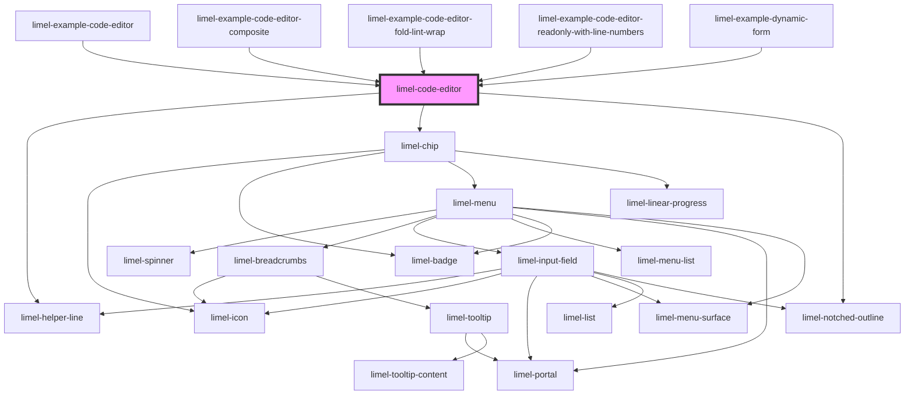

# limel-code-editor

<!-- Auto Generated Below -->

## Properties

| Property              | Attribute              | Description                                                                                                                                                                                                                                | Type                                                                    | Default     |
| --------------------- | ---------------------- | ------------------------------------------------------------------------------------------------------------------------------------------------------------------------------------------------------------------------------------------ | ----------------------------------------------------------------------- | ----------- |
| `colorScheme`         | `color-scheme`         | Select color scheme for the editor                                                                                                                                                                                                         | `"auto" \| "dark" \| "light"`                                           | `'auto'`    |
| `disabled`            | `disabled`             | Set to `true` to disable the editor. Use `disabled` to indicate that the editor can normally be interacted with, but is currently disabled. This tells the user that if certain requirements are met, the editor may become enabled again. | `boolean`                                                               | `false`     |
| `fold`                | `fold`                 | Allows the user to fold code                                                                                                                                                                                                               | `boolean`                                                               | `false`     |
| `helperText`          | `helper-text`          | Optional helper text to display below the input field when it has focus                                                                                                                                                                    | `string`                                                                | `undefined` |
| `invalid`             | `invalid`              | Set to `true` to indicate that the current value of the input editor is invalid.                                                                                                                                                           | `boolean`                                                               | `false`     |
| `label`               | `label`                | The input label.                                                                                                                                                                                                                           | `string`                                                                | `undefined` |
| `language`            | `language`             | The language of the code                                                                                                                                                                                                                   | `"css" \| "html" \| "javascript" \| "jinja2" \| "json" \| "typescript"` | `undefined` |
| `lineNumbers`         | `line-numbers`         | Displays line numbers in the editor                                                                                                                                                                                                        | `boolean`                                                               | `false`     |
| `lineWrapping`        | `line-wrapping`        | Wraps long lines instead of showing horizontal scrollbar                                                                                                                                                                                   | `boolean`                                                               | `false`     |
| `lint`                | `lint`                 | Enables linting of JSON content                                                                                                                                                                                                            | `boolean`                                                               | `false`     |
| `readonly`            | `readonly`             | Set to `true` to make the editor read-only. Use `readonly` when the editor is only there to present the data it holds, and will not become possible for the current user to edit.                                                          | `boolean`                                                               | `false`     |
| `required`            | `required`             | Set to `true` to indicate that the field is required.                                                                                                                                                                                      | `boolean`                                                               | `false`     |
| `translationLanguage` | `translation-language` | Defines the language for translations. Will translate the translatable strings on the components.                                                                                                                                          | `"da" \| "de" \| "en" \| "fi" \| "fr" \| "nb" \| "nl" \| "no" \| "sv"`  | `'en'`      |
| `value`               | `value`                | The code to be rendered                                                                                                                                                                                                                    | `string`                                                                | `''`        |

## Events

| Event    | Description                                                                               | Type                  |
| -------- | ----------------------------------------------------------------------------------------- | --------------------- |
| `change` | Emitted when the code has changed. Will only be emitted when the code area has lost focus | `CustomEvent<string>` |

## Dependencies

### Used by

 - [limel-example-code-editor](examples)
 - [limel-example-code-editor-composite](examples)
 - [limel-example-code-editor-fold-lint-wrap](examples)
 - [limel-example-code-editor-readonly-with-line-numbers](examples)
 - [limel-example-dynamic-form](../form/examples)

### Depends on

- [limel-helper-line](../helper-line)
- [limel-chip](../chip)
- [limel-notched-outline](../notched-outline)

### Graph

----------------------------------------------

*Built with [StencilJS](https://stenciljs.com/)*
