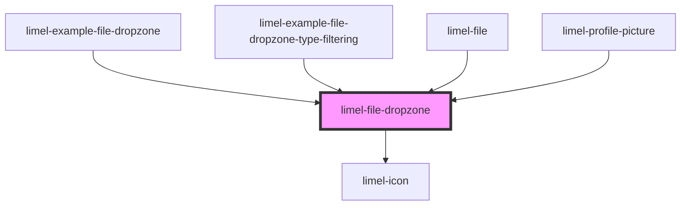

# limel-file-dropzone

<!-- Auto Generated Below -->

## Overview

This component enables you to seamlessly convert any region of the user interface into
a file dropzone area, just by wrapping it inside the `limel-file-dropzone`.

The file dropzone can then be used to allow end-users to upload files
by dragging and dropping them into the specified area, for example to trigger an upload process.

After receiving the files, the component emits a `filesSelected` event. For unsupported
files (specified with the `accept` prop) a `filesRejected` event will be emitted.

The event detail would be an array of `FileInfo` objects,
each representing a file dropped into the dropzone.

## Properties

| Property     | Attribute     | Description                                                                                                                                                                                                                                                                                                                                                                                          | Type      | Default     |
| ------------ | ------------- | ---------------------------------------------------------------------------------------------------------------------------------------------------------------------------------------------------------------------------------------------------------------------------------------------------------------------------------------------------------------------------------------------------- | --------- | ----------- |
| `accept`     | `accept`      | Specifies the types of files that the dropzone will accept. By default, all file types are accepted.  For media files, formats can be specified using: `audio/*`, `video/*`, `image/*`. Unique file type specifiers can also be used, for example: `.jpg`, `.pdf`. A comma-separated list of file extensions or MIME types is also acceptable, e.g., `image/png, image/jpeg` or `.png, .jpg, .jpeg`. | `string`  | `'*'`       |
| `disabled`   | `disabled`    | Set to `true` to disable the file dropzone.                                                                                                                                                                                                                                                                                                                                                          | `boolean` | `false`     |
| `helperText` | `helper-text` | Is displayed to provide supplementary information to the end users, for instance, which filetypes or file sizes are accepted.                                                                                                                                                                                                                                                                        | `string`  | `''`        |
| `text`       | `text`        | Is displayed when the user is dragging a file over the dropzone. A suitable text could for instance be "Drop your files here".                                                                                                                                                                                                                                                                       | `string`  | `undefined` |

## Events

| Event           | Description                                                                                                                                                                                                                                             | Type                      |
| --------------- | ------------------------------------------------------------------------------------------------------------------------------------------------------------------------------------------------------------------------------------------------------- | ------------------------- |
| `filesRejected` | Emitted when files are selected but do not conform with the `accept` property specifications. This can happen when the file types or formats of the selected files are not among the ones allowed by the dropzone, as defined by the `accept` property. | `CustomEvent<FileInfo[]>` |
| `filesSelected` | Emitted when files are selected                                                                                                                                                                                                                         | `CustomEvent<FileInfo[]>` |

## Dependencies

### Used by

 - [limel-example-file-dropzone](examples)
 - [limel-example-file-dropzone-type-filtering](examples)
 - [limel-file](../file)
 - [limel-profile-picture](../profile-picture)

### Depends on

- [limel-icon](../icon)

### Graph

----------------------------------------------

*Built with [StencilJS](https://stenciljs.com/)*
