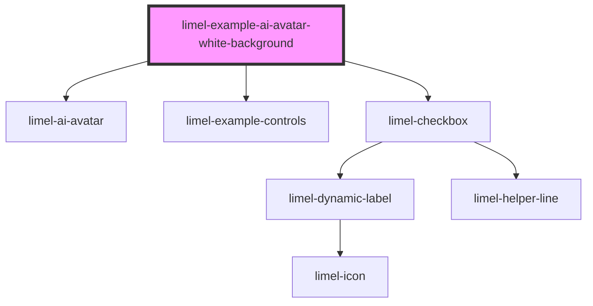

# limel-example-ai-avatar-white-background

<!-- Auto Generated Below -->

## Overview

Light Background

The avatar renders decently on darker colors, since its visual details use a
`mix-blend-mode` to blend in with the background, and still have some
visible contrast.
However, when the AI avatar is placed on a white or light background,
the default blend modes (`plus-lighter` and `screen`) can make
the avatar nearly invisible.

This example demonstrates how to override the blend modes using
custom CSS properties to ensure proper visibility:

- `--ai-avatar-core-blend-mode: normal`
- `--ai-avatar-rings-blend-mode: normal`

## Dependencies

### Depends on

- [limel-ai-avatar](..)
- [limel-example-controls](../../../examples)
- [limel-checkbox](../../checkbox)

### Graph

----------------------------------------------

*Built with [StencilJS](https://stenciljs.com/)*
