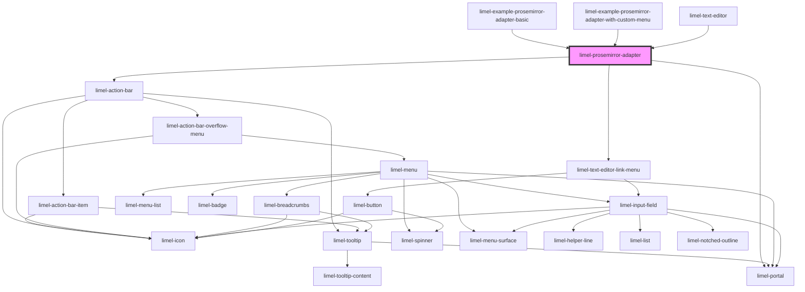

# limel-prosemirror-adapter

<!-- Auto Generated Below -->

## Overview

The ProseMirror adapter offers a rich text editing experience with markdown support.
[Read more...](https://prosemirror.net/)

## Properties

| Property            | Attribute      | Description                                                                                                                                                                                                                             | Type                                                                   | Default      |
| ------------------- | -------------- | --------------------------------------------------------------------------------------------------------------------------------------------------------------------------------------------------------------------------------------- | ---------------------------------------------------------------------- | ------------ |
| `contentType`       | `content-type` | The type of content that the editor should handle and emit, defaults to `markdown`  Assumed to be set only once, so not reactive to changes                                                                                             | `"html" \| "markdown"`                                                 | `'markdown'` |
| `customElements`    | --             | set to private to avoid usage while under development                                                                                                                                                                                   | `CustomElementDefinition[]`                                            | `[]`         |
| `disabled`          | `disabled`     | Set to `true` to disable the field. Use `disabled` to indicate that the field can normally be interacted with, but is currently disabled. This tells the user that if certain requirements are met, the field may become enabled again. | `boolean`                                                              | `false`      |
| `language`          | `language`     | Defines the language for translations.                                                                                                                                                                                                  | `"da" \| "de" \| "en" \| "fi" \| "fr" \| "nb" \| "nl" \| "no" \| "sv"` | `undefined`  |
| `triggerCharacters` | --             | set to private to avoid usage while under development                                                                                                                                                                                   | `TriggerCharacter[]`                                                   | `[]`         |
| `ui`                | `ui`           | Specifies the visual appearance of the editor.                                                                                                                                                                                          | `"minimal" \| "no-toolbar" \| "standard"`                              | `'standard'` |
| `value`             | `value`        | The value of the editor, expected to be markdown                                                                                                                                                                                        | `string`                                                               | `undefined`  |

## Events

| Event            | Description                                                           | Type                          |
| ---------------- | --------------------------------------------------------------------- | ----------------------------- |
| `change`         | Dispatched when a change is made to the editor                        | `CustomEvent<string>`         |
| `imagePasted`    | Dispatched when a image is pasted into the editor                     | `CustomEvent<ImageInserter>`  |
| `imageRemoved`   | Dispatched when a image is removed from the editor                    | `CustomEvent<EditorImage>`    |
| `metadataChange` | Dispatched when the metadata of the editor changes (images and links) | `CustomEvent<EditorMetadata>` |

## Dependencies

### Used by

 - [limel-example-prosemirror-adapter-basic](examples)
 - [limel-example-prosemirror-adapter-with-custom-menu](examples)
 - [limel-text-editor](..)

### Depends on

- [limel-action-bar](../../action-bar)
- [limel-portal](../../portal)
- [limel-text-editor-link-menu](../link-menu)

### Graph

----------------------------------------------

*Built with [StencilJS](https://stenciljs.com/)*
