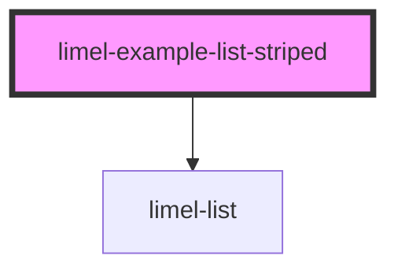

# limel-example-list-striped

<!-- Auto Generated Below -->

## Overview

List with custom styles

Adding the `has-striped-rows` class to the list will make the items more
distinct by adding different background colors to even and odd rows.

Also, by taking advantage of the `has-interactive-items`, hovering on a list
item which is not `disabled` will display an elevated visual effect, giving
it more affordance and a solid feeling of interactivity.

| Class name              | Description                                                                                     |
| ----------------------- | ----------------------------------------------------------------------------------------------- |
| `has-striped-rows`      | Adds distinct styling by which every other row (list item) gets a darker background.            |
| `has-interactive-items` | Adds more affordance by applying an elevated visual effect on list item, when they are hovered. |

:::note
to get both effects, you need to apply both of these classes.
:::

## Dependencies

### Depends on

- [limel-list](..)

### Graph

----------------------------------------------

*Built with [StencilJS](https://stenciljs.com/)*
