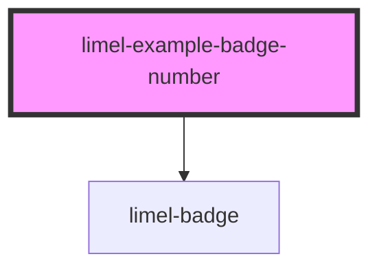

<!-- Auto Generated Below -->

## Overview

Number badges

Numeric labels larger than 999 will get both rounded and abbreviated.
For example, if the label is `1090` the badge will display `1.1K`.
Abbreviation units used are `k` (Kilo) that stands for Thousands,
`M` for Millions, `B` for Billions, and `T` for Trillions.

When users hover the abbreviated badge, the complete
`label` will be displayed in a tooltip.

## Dependencies

### Depends on

- [limel-badge](..)

### Graph

----------------------------------------------

*Built with [StencilJS](https://stenciljs.com/)*
