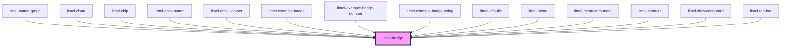

# limel-badge

<!-- Auto Generated Below -->

## Overview

The Badge component can be used to display a notification badge,
optionally with a number or a text label.

## Properties

| Property | Attribute | Description                                                                                                                                                               | Type               | Default     |
| -------- | --------- | ------------------------------------------------------------------------------------------------------------------------------------------------------------------------- | ------------------ | ----------- |
| `label`  | `label`   | Label to display in the badge. Numeric labels larger than 999 will be rounded and abbreviated. String labels get truncated if their length is longer than six characters. | `number \| string` | `undefined` |

## Dependencies

### Used by

 - [limel-button-group](../button-group)
 - [limel-chart](../chart)
 - [limel-chip](../chip)
 - [limel-dock-button](../dock/dock-button)
 - [limel-email-viewer](../email-viewer)
 - [limel-example-badge](examples)
 - [limel-example-badge-number](examples)
 - [limel-example-badge-string](examples)
 - [limel-info-tile](../info-tile)
 - [limel-menu](../menu)
 - [limel-menu-item-meta](../list-item/menu-item-meta)
 - [limel-shortcut](../shortcut)
 - [limel-showcase-card](../../examples/whats-new)
 - [limel-tab-bar](../tab-bar)

### Graph

----------------------------------------------

*Built with [StencilJS](https://stenciljs.com/)*
