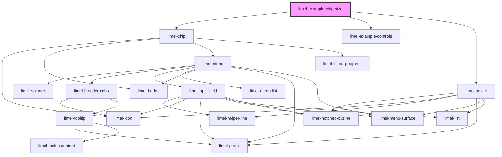

<!-- Auto Generated Below -->

## Overview

Size
When the `size` property is set to `small`, the chip will render
with a smaller height and gap.

## Dependencies

### Depends on

- [limel-chip](..)
- [limel-example-controls](../../../examples)
- [limel-select](../../select)

### Graph

----------------------------------------------

*Built with [StencilJS](https://stenciljs.com/)*
