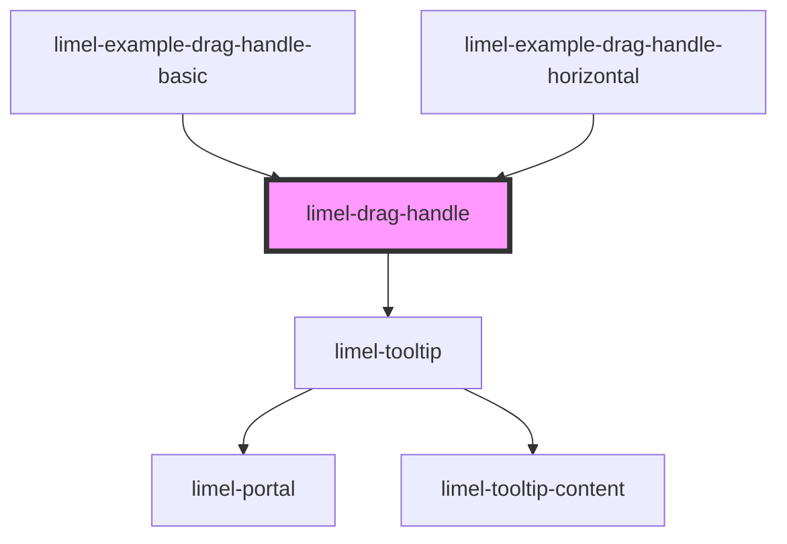

<!-- Auto Generated Below -->

## Overview

This component resembles a drag handle button, but is implemented
as a `private` component to allow for easier styling and future extensions.

:::important
This component has its `shadow` set to `false` in order to
integrate well with the drag-and-drop functionality, as well as
providing a better accessibility.

Keep in mind that its styles might be affected by the consumer
component, due to its light dom.
:::

:::tip
It's recommended to place the drag handle on the right side of
the item it is meant to reorder, to ensure consistent layout
design conventions.
:::

## Properties

| Property               | Attribute                | Description                                                                                                                                                                   | Type                                                                                                                                                                 | Default      |
| ---------------------- | ------------------------ | ----------------------------------------------------------------------------------------------------------------------------------------------------------------------------- | -------------------------------------------------------------------------------------------------------------------------------------------------------------------- | ------------ |
| `dragDirection`        | `drag-direction`         | The direction in which the drag handle can be used to reorder items.                                                                                                          | `"horizontal" \| "vertical"`                                                                                                                                         | `'vertical'` |
| `language`             | `language`               | Language to use for translations.                                                                                                                                             | `"da" \| "de" \| "en" \| "fi" \| "fr" \| "nb" \| "nl" \| "no" \| "sv"`                                                                                               | `'en'`       |
| `tooltipOpenDirection` | `tooltip-open-direction` | The preferred direction for the tooltip to open. Defaults to 'left', as our recommended placement for a drag handle in the UI is on the far right side of draggable elements. | `"bottom" \| "bottom-end" \| "bottom-start" \| "left" \| "left-end" \| "left-start" \| "right" \| "right-end" \| "right-start" \| "top" \| "top-end" \| "top-start"` | `'left'`     |

## Dependencies

### Used by

 - [limel-example-drag-handle-basic](examples)
 - [limel-example-drag-handle-horizontal](examples)

### Depends on

- [limel-tooltip](../tooltip)

### Graph

----------------------------------------------

*Built with [StencilJS](https://stenciljs.com/)*
