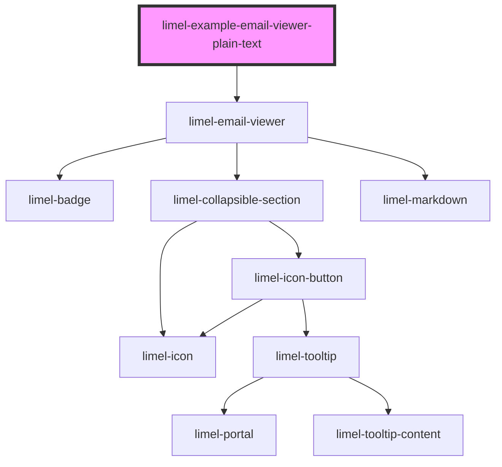

<!-- Auto Generated Below -->

## Overview

Plain text email

Example showing a plain text email body with all header fields set,
including multiple recipients.

:::note
If multiple recipients are provided as `to` or `cc`,
they should be separated by commas.
When rendering, this component splits the list on commas that are
outside quoted strings (that indicate the name) and outside
angle-bracketed address parts.

If a display name contains a comma, it should be quoted, e.g.
`"Doe, Jane" <jane.doe@example.com>`.
:::

## Dependencies

### Depends on

- [limel-email-viewer](..)

### Graph

----------------------------------------------

*Built with [StencilJS](https://stenciljs.com/)*
