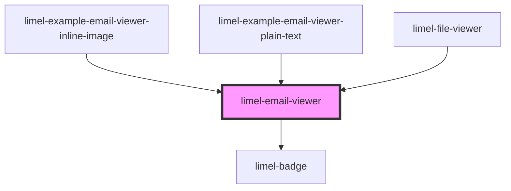

# limel-email-viewer

<!-- Auto Generated Below -->

## Overview

This is a private component, used to render `.eml` files inside
`limel-file-viewer`.

:::note
If `bodyHtml` is provided, it will be rendered using `innerHTML`.
:::

## Properties

| Property      | Attribute      | Description                                                                       | Type                                                                   | Default     |
| ------------- | -------------- | --------------------------------------------------------------------------------- | ---------------------------------------------------------------------- | ----------- |
| `attachments` | --             | List of non-inline attachments.                                                   | `EmailAttachment[]`                                                    | `undefined` |
| `bodyHtml`    | `body-html`    | HTML email body.                                                                  | `string`                                                               | `undefined` |
| `bodyText`    | `body-text`    | Plain text email body.                                                            | `string`                                                               | `undefined` |
| `cc`          | `cc`           | Cc header.                                                                        | `string`                                                               | `undefined` |
| `date`        | `date`         | RFC 5322 Date header.                                                             | `string`                                                               | `undefined` |
| `fallbackUrl` | `fallback-url` | Optional URL to render as a final fallback using an `<object type="text/plain">`. | `string`                                                               | `undefined` |
| `from`        | `from`         | From header.                                                                      | `string`                                                               | `undefined` |
| `language`    | `language`     | Defines the localization for translations.                                        | `"da" \| "de" \| "en" \| "fi" \| "fr" \| "nb" \| "nl" \| "no" \| "sv"` | `'en'`      |
| `subject`     | `subject`      | Subject header.                                                                   | `string`                                                               | `undefined` |
| `to`          | `to`           | To header.                                                                        | `string`                                                               | `undefined` |

## Shadow Parts

| Part              | Description |
| ----------------- | ----------- |
| `"email"`         |             |
| `"email-body"`    |             |
| `"email-headers"` |             |

## Dependencies

### Used by

 - [limel-example-email-viewer-inline-image](examples)
 - [limel-example-email-viewer-plain-text](examples)
 - [limel-file-viewer](../file-viewer)

### Depends on

- [limel-badge](../badge)

### Graph

----------------------------------------------

*Built with [StencilJS](https://stenciljs.com/)*
