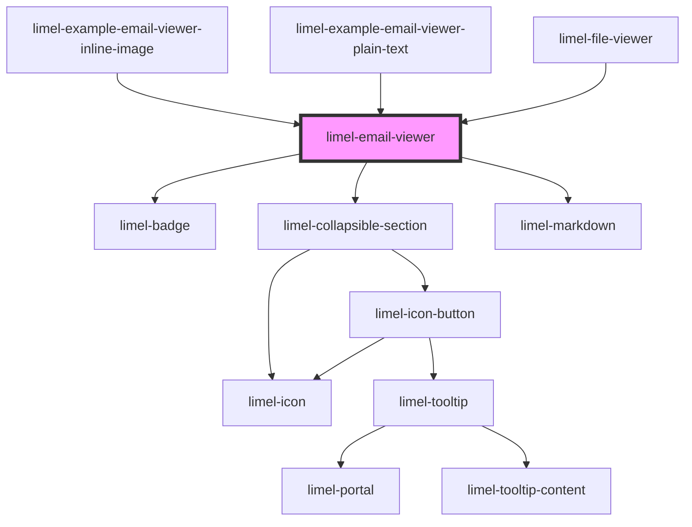

# limel-email-viewer

<!-- Auto Generated Below -->

## Overview

This is a private component, used to render `.eml` files inside
`limel-file-viewer`.

:::note
If `bodyHtml` is provided, it will be rendered using `innerHTML`.
:::

## Properties

| Property            | Attribute             | Description                                                                                                                                                                                                                                                                                                                   | Type                                                                   | Default     |
| ------------------- | --------------------- | ----------------------------------------------------------------------------------------------------------------------------------------------------------------------------------------------------------------------------------------------------------------------------------------------------------------------------- | ---------------------------------------------------------------------- | ----------- |
| `allowRemoteImages` | `allow-remote-images` | Controls whether remote images (http/https) are loaded.  If omitted, the component treats this as a per-email setting. Consumers that want to remember the choice (per session/global) can provide this prop and listen for `allowRemoteImagesChange`.                                                                        | `boolean`                                                              | `undefined` |
| `attachments`       | --                    | List of non-inline attachments.                                                                                                                                                                                                                                                                                               | `EmailAttachment[]`                                                    | `undefined` |
| `bodyHtml`          | `body-html`           | HTML email body.                                                                                                                                                                                                                                                                                                              | `string`                                                               | `undefined` |
| `bodyText`          | `body-text`           | Plain text email body.                                                                                                                                                                                                                                                                                                        | `string`                                                               | `undefined` |
| `cc`                | `cc`                  | Cc header.  Behaves like `to`: multiple recipients can be provided as a comma-separated list, and the list is split on commas outside quotes and outside `<...>`.                                                                                                                                                             | `string`                                                               | `undefined` |
| `date`              | `date`                | RFC 5322 Date header.                                                                                                                                                                                                                                                                                                         | `string`                                                               | `undefined` |
| `fallbackUrl`       | `fallback-url`        | Optional URL to render as a final fallback using an `<object type="text/plain">`.                                                                                                                                                                                                                                             | `string`                                                               | `undefined` |
| `from`              | `from`                | From header.                                                                                                                                                                                                                                                                                                                  | `string`                                                               | `undefined` |
| `language`          | `language`            | Defines the localization for translations.                                                                                                                                                                                                                                                                                    | `"da" \| "de" \| "en" \| "fi" \| "fr" \| "nb" \| "nl" \| "no" \| "sv"` | `'en'`      |
| `subject`           | `subject`             | Subject header.                                                                                                                                                                                                                                                                                                               | `string`                                                               | `undefined` |
| `to`                | `to`                  | To header.  If multiple recipients are provided, they should be separated by commas. When rendering, this component splits the list on commas that are outside quoted strings and outside angle-bracketed address parts.  If a display name contains a comma, it should be quoted, e.g. `"Doe, Jane" <jane.doe@example.com>`. | `string`                                                               | `undefined` |

## Events

| Event                     | Description                                                | Type                   |
| ------------------------- | ---------------------------------------------------------- | ---------------------- |
| `allowRemoteImagesChange` | Emitted when the user requests remote images to be loaded. | `CustomEvent<boolean>` |

## Shadow Parts

| Part              | Description |
| ----------------- | ----------- |
| `"email"`         |             |
| `"email-body"`    |             |
| `"email-headers"` |             |

## Dependencies

### Used by

 - [limel-example-email-viewer-inline-image](examples)
 - [limel-example-email-viewer-plain-text](examples)
 - [limel-file-viewer](../file-viewer)

### Depends on

- [limel-badge](../badge)
- [limel-collapsible-section](../collapsible-section)
- [limel-markdown](../markdown)

### Graph

----------------------------------------------

*Built with [StencilJS](https://stenciljs.com/)*
