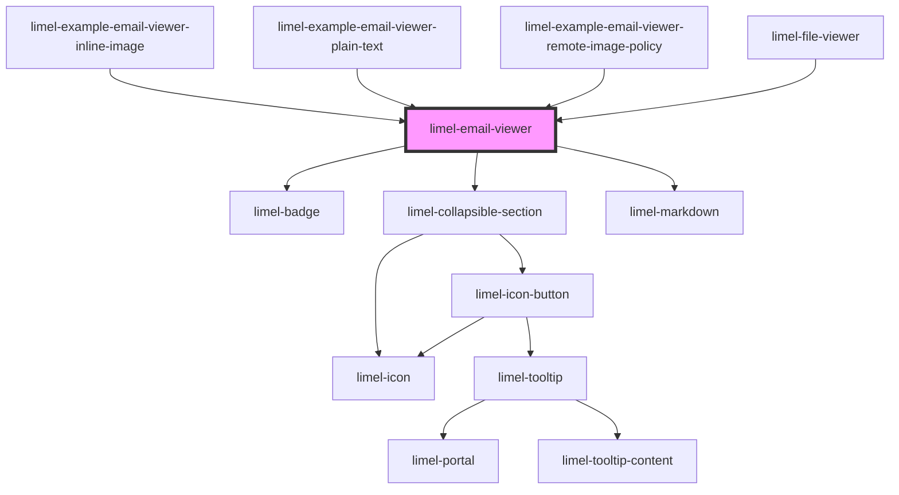

<!-- Auto Generated Below -->

## Overview

This is a private component, used to render `.eml` files inside
`limel-file-viewer`.

:::note
If `bodyHtml` is provided, it will be rendered using `innerHTML`.
Consumers should pre-sanitize `bodyHtml` before passing it to the component.
:::

## Properties

| Property            | Attribute             | Description                                                                                                                                                                                                                                            | Type                                                                   | Default     |
| ------------------- | --------------------- | ------------------------------------------------------------------------------------------------------------------------------------------------------------------------------------------------------------------------------------------------------ | ---------------------------------------------------------------------- | ----------- |
| `allowRemoteImages` | `allow-remote-images` | Controls whether remote images (http/https) are loaded.  If omitted, the component treats this as a per-email setting. Consumers that want to remember the choice (per session/global) can provide this prop and listen for `allowRemoteImagesChange`. | `boolean`                                                              | `undefined` |
| `email`             | --                    | The email message to display.  If `email.bodyHtml` is set directly, consumers must provide sanitized HTML.                                                                                                                                             | `Email`                                                                | `undefined` |
| `fallbackUrl`       | `fallback-url`        | Optional URL to render as a final fallback using an `<object type="text/plain">`.                                                                                                                                                                      | `string`                                                               | `undefined` |
| `language`          | `language`            | Defines the localization for translations.                                                                                                                                                                                                             | `"da" \| "de" \| "en" \| "fi" \| "fr" \| "nb" \| "nl" \| "no" \| "sv"` | `'en'`      |

## Shadow Parts

| Part              | Description |
| ----------------- | ----------- |
| `"email"`         |             |
| `"email-body"`    |             |
| `"email-headers"` |             |

## Dependencies

### Used by

 - [limel-example-email-viewer-inline-image](examples)
 - [limel-example-email-viewer-plain-text](examples)
 - [limel-example-email-viewer-remote-image-policy](examples)
 - [limel-file-viewer](../file-viewer)

### Depends on

- [limel-badge](../badge)
- [limel-collapsible-section](../collapsible-section)
- [limel-markdown](../markdown)

### Graph

----------------------------------------------

*Built with [StencilJS](https://stenciljs.com/)*
