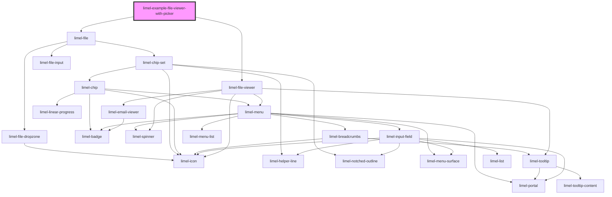

# limel-example-file-viewer-with-picker

<!-- Auto Generated Below -->

## Overview

See an instant preview
Select a file from your local machine using the file picker below,
and `limel-file-viewer` component will display the file, if the format
is supported.

## Dependencies

### Depends on

- [limel-file](../../file)
- [limel-file-viewer](..)

### Graph

----------------------------------------------

*Built with [StencilJS](https://stenciljs.com/)*
