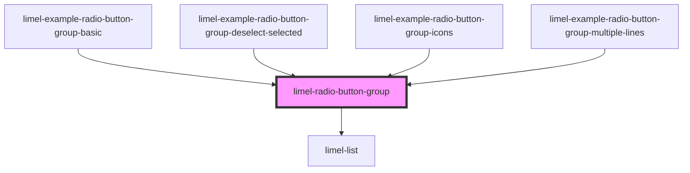

<!-- Auto Generated Below -->

## Overview

The Radio Button component provides a convenient way to create a group of radio buttons
from an array of options. Radio buttons allow users to select a single option from
multiple choices, making them ideal for exclusive selections.

:::note
A single radio button is never useful in a UI. Radio buttons should always come in groups
of at least 2 options where only one can be selected at a time.
:::

## Properties

| Property                | Attribute                  | Description                                                                                                                                                                                                                                                           | Type                                 | Default     |
| ----------------------- | -------------------------- | --------------------------------------------------------------------------------------------------------------------------------------------------------------------------------------------------------------------------------------------------------------------- | ------------------------------------ | ----------- |
| `badgeIcons`            | `badge-icons`              | Set to `true` if the radio button group should display larger icons with a background                                                                                                                                                                                 | `boolean`                            | `undefined` |
| `disabled`              | `disabled`                 | Disables all radio buttons when `true`                                                                                                                                                                                                                                | `boolean`                            | `false`     |
| `items`                 | --                         | Array of radio button options to display                                                                                                                                                                                                                              | `(ListSeparator \| ListItem<any>)[]` | `undefined` |
| `maxLinesSecondaryText` | `max-lines-secondary-text` | By default, lists will display 3 lines of text, and then truncate the rest. Consumers can increase or decrease this number by specifying `maxLinesSecondaryText`. If consumer enters zero or negative numbers we default to 1; and if they type decimals we round up. | `number`                             | `3`         |
| `selectedItem`          | --                         | The currently selected item in the radio button group. This is a ListItem object that contains the value and other properties of the selected item. If no item is selected, this will be `undefined`.                                                                 | `ListItem<string \| number>`         | `undefined` |

## Events

| Event    | Description                                                       | Type                                      |
| -------- | ----------------------------------------------------------------- | ----------------------------------------- |
| `change` | Emitted when the selection changes with the full ListItem payload | `CustomEvent<ListItem<string \| number>>` |

## Dependencies

### Used by

 - [limel-example-radio-button-group-basic](examples)
 - [limel-example-radio-button-group-deselect-selected](examples)
 - [limel-example-radio-button-group-icons](examples)
 - [limel-example-radio-button-group-multiple-lines](examples)

### Depends on

- [limel-list](../list)

### Graph

----------------------------------------------

*Built with [StencilJS](https://stenciljs.com/)*
