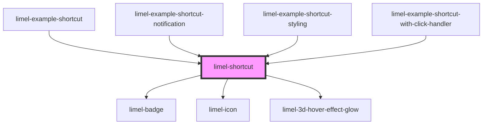

<!-- Auto Generated Below -->

## Overview

This component can be used on places such as a start page or a dashboard.
Clicking on the component should navigate the user to a new screen,
to which you need to provide a URL, by specifying an `href` for the `link` property.

By default, this navigation will happen within the same browser tab.
However, it is possible to override that behavior, by specifying a `target`
for the `link` property

## Properties

| Property   | Attribute  | Description                                                        | Type               | Default     |
| ---------- | ---------- | ------------------------------------------------------------------ | ------------------ | ----------- |
| `badge`    | `badge`    | If specified, will display a notification badge on the shortcut.   | `number \| string` | `undefined` |
| `disabled` | `disabled` | Set to `true` if shortcut is disabled.                             | `boolean`          | `false`     |
| `icon`     | `icon`     | Name of icon for the shortcut.                                     | `string`           | `undefined` |
| `label`    | `label`    | The text to show below the shortcut. Long label will be truncated. | `string`           | `null`      |
| `link`     | --         | If supplied, the shortcut will be a clickable link.                | `Link`             | `undefined` |

## Dependencies

### Used by

 - [limel-example-shortcut](examples)
 - [limel-example-shortcut-notification](examples)
 - [limel-example-shortcut-styling](examples)
 - [limel-example-shortcut-with-click-handler](examples)

### Depends on

- [limel-badge](../badge)
- [limel-icon](../icon)
- [limel-3d-hover-effect-glow](../3d-hover-effect-glow)

### Graph

----------------------------------------------

*Built with [StencilJS](https://stenciljs.com/)*
