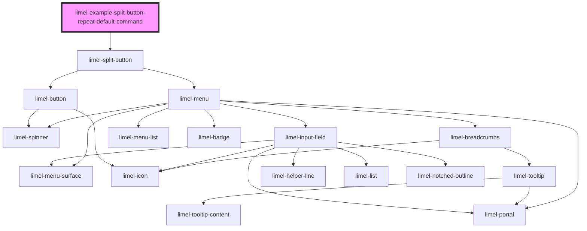

<!-- Auto Generated Below -->

## Overview

Repeating the default command in the menu

The default command must be the most commonly used action.
Such actions typically have a very short label.

However, sometimes it could be useful to repeat the default command again
in the list of commands, using a more descriptive label which
clarifies the default action.

:::tip
- **Limit the overall number of choices** within the menu to less than 10
- **Order the items within the menu by popularity** and put the most popular ones on top.
:::

## Dependencies

### Depends on

- [limel-split-button](..)

### Graph

----------------------------------------------

*Built with [StencilJS](https://stenciljs.com/)*
