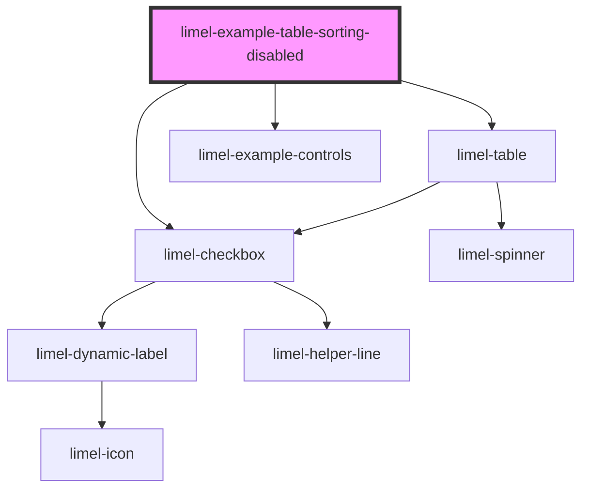

<!-- Auto Generated Below -->

## Overview

Disable column sorting

By default, all columns can be sorted by end-users, if they click on
a column header. An arrow icon on the header visualizes the
direction of sorting, when a column is sorted.

To prevent sorting altogether, set the `sortableColumns` property on
`limel-table` to `false`. If you only want to disable sorting for a
specific column, set the column's `headerSort` property to `false`.

The "Reference Person" column below has sorting disabled on the
column definition, while the control lets you disable sorting for
the whole table.

## Dependencies

### Depends on

- [limel-table](..)
- [limel-example-controls](../../../examples)
- [limel-checkbox](../../checkbox)

### Graph

----------------------------------------------

*Built with [StencilJS](https://stenciljs.com/)*
