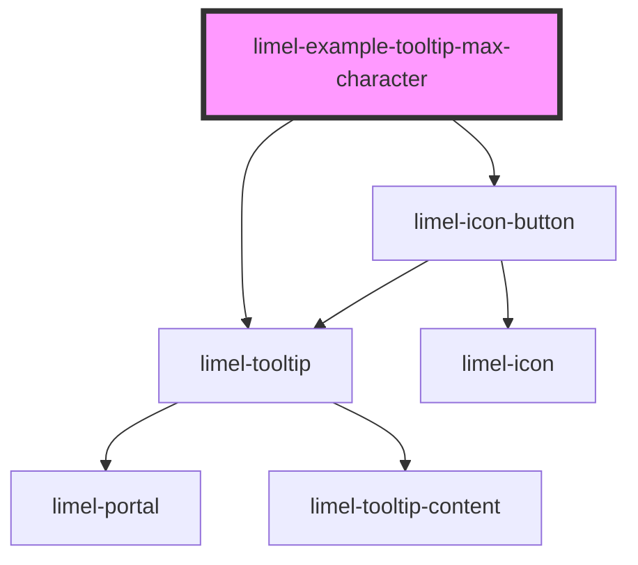

<!-- Auto Generated Below -->

## Overview

Using `maxlength` property
To present an easy to read content, the tooltip's maximum text
length is set to 50 characters, including spaces.
When this threshold is reached, content will be rendered with line breaks.
However, it is possible to override this value by specifying `maxlength`.

:::note
Tooltips are intended to display very brief information.
Try not to place large amount of text in them.
:::

## Dependencies

### Depends on

- [limel-icon-button](../../icon-button)
- [limel-tooltip](..)

### Graph

----------------------------------------------

*Built with [StencilJS](https://stenciljs.com/)*
