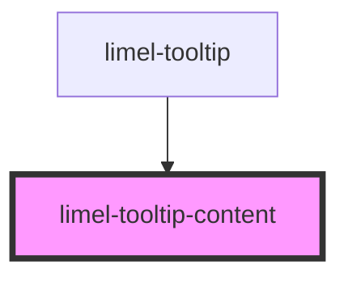

<!-- Auto Generated Below -->

## Overview

This component is used internally by `limel-tooltip`.

## Properties

| Property             | Attribute      | Description              | Type     | Default     |
| -------------------- | -------------- | ------------------------ | -------- | ----------- |
| `helperLabel`        | `helper-label` | Read more in tooltip.tsx | `string` | `undefined` |
| `label` _(required)_ | `label`        | Read more in tooltip.tsx | `string` | `undefined` |
| `maxlength`          | `maxlength`    | Read more in tooltip.tsx | `number` | `undefined` |

## Dependencies

### Used by

 - [limel-tooltip](.)

### Graph

----------------------------------------------

*Built with [StencilJS](https://stenciljs.com/)*
