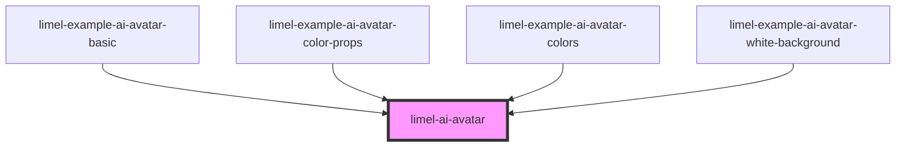

# limel-ai-avatar

<!-- Auto Generated Below -->

## Overview

This component displays an avatar, representing Lime AI assistants.

:::warning
This is a private component used internally in the Lime's various applications,
which is the reason for having it in Lime Elements —to ease the distribution
of the component across all our apps.

3rd party developers are not allowed use this component directly.
:::

## Properties

| Property     | Attribute     | Description                                                                                          | Type                                                                   | Default                                      |
| ------------ | ------------- | ---------------------------------------------------------------------------------------------------- | ---------------------------------------------------------------------- | -------------------------------------------- |
| `isThinking` | `is-thinking` | Set to `true` to trigger animations that indicate that the AI is "thinking" or processing something. | `boolean`                                                              | `false`                                      |
| `language`   | `language`    | Defines the language for translations.                                                               | `"da" \| "de" \| "en" \| "fi" \| "fr" \| "nb" \| "nl" \| "no" \| "sv"` | `document.documentElement.lang as Languages` |

## Dependencies

### Used by

 - [limel-example-ai-avatar-basic](examples)
 - [limel-example-ai-avatar-color-props](examples)
 - [limel-example-ai-avatar-colors](examples)
 - [limel-example-ai-avatar-white-background](examples)

### Graph

----------------------------------------------

*Built with [StencilJS](https://stenciljs.com/)*
