# limel-button

<!-- Auto Generated Below -->

## Properties

| Property        | Attribute        | Description                                                                                               | Type             | Default     |
| --------------- | ---------------- | --------------------------------------------------------------------------------------------------------- | ---------------- | ----------- |
| `disabled`      | `disabled`       | Set to `true` to disable the button.                                                                      | `boolean`        | `false`     |
| `icon`          | `icon`           | Set icon for the button                                                                                   | `Icon \| string` | `undefined` |
| `label`         | `label`          | The text to show on the button.                                                                           | `string`         | `undefined` |
| `loading`       | `loading`        | Set to `true` to put the button in the `loading` state. This also disables the button.                    | `boolean`        | `false`     |
| `loadingFailed` | `loading-failed` | Set to `true` to indicate failure instead of success when the button is no longer in the `loading` state. | `boolean`        | `false`     |
| `outlined`      | `outlined`       | Set to `true` to make the button outlined.                                                                | `boolean`        | `false`     |
| `primary`       | `primary`        | Set to `true` to make the button primary.                                                                 | `boolean`        | `false`     |

## Dependencies

### Used by

 - [limel-example-action-buttons-choosing-explicit-labels](../../design-guidelines/action-buttons/examples)
 - [limel-example-action-buttons-choosing-labels](../../design-guidelines/action-buttons/examples)
 - [limel-example-action-buttons-colors-do-dont](../../design-guidelines/action-buttons/examples)
 - [limel-example-action-buttons-icon-color](../../design-guidelines/action-buttons/examples)
 - [limel-example-action-buttons-placement](../../design-guidelines/action-buttons/examples)
 - [limel-example-action-buttons-primary-secondary](../../design-guidelines/action-buttons/examples)
 - [limel-example-action-buttons-primary-secondary-reversed](../../design-guidelines/action-buttons/examples)
 - [limel-example-action-buttons-primary-secondary-reversed-colors](../../design-guidelines/action-buttons/examples)
 - [limel-example-action-buttons-third-alternative](../../design-guidelines/action-buttons/examples)
 - [limel-example-banner](../banner/examples)
 - [limel-example-builtin-field-types-form](../form/examples)
 - [limel-example-button-basic](examples)
 - [limel-example-button-click-fail](examples)
 - [limel-example-button-click-success](examples)
 - [limel-example-button-colors](examples)
 - [limel-example-button-composite](examples)
 - [limel-example-button-disabled](examples)
 - [limel-example-button-disabled-vs-hidden](../../design-guidelines/disabled-hidden/examples)
 - [limel-example-button-icon](examples)
 - [limel-example-button-loading](examples)
 - [limel-example-button-outlined](examples)
 - [limel-example-button-primary](examples)
 - [limel-example-button-reduce-presence](examples)
 - [limel-example-collapsible-section-external-control](../collapsible-section/examples)
 - [limel-example-colors-in-components](../../design-guidelines/color-system/examples)
 - [limel-example-custom-error-message](../form/examples)
 - [limel-example-date-picker-programmatic-change](../date-picker/examples)
 - [limel-example-dialog](../dialog/examples)
 - [limel-example-dialog-action-buttons](../dialog/examples)
 - [limel-example-dialog-closing-actions](../dialog/examples)
 - [limel-example-dialog-form](../dialog/examples)
 - [limel-example-dialog-fullscreen](../dialog/examples)
 - [limel-example-dialog-heading](../dialog/examples)
 - [limel-example-dialog-heading-actions](../dialog/examples)
 - [limel-example-dialog-nested-close-events](../dialog/examples)
 - [limel-example-dialog-size](../dialog/examples)
 - [limel-example-file-input](../file-input/examples)
 - [limel-example-file-input-type-filtering](../file-input/examples)
 - [limel-example-form](../form/examples)
 - [limel-example-form-layout](../form/examples)
 - [limel-example-form-span-fields](../form/examples)
 - [limel-example-input-field-focus](../input-field/examples)
 - [limel-example-input-field-selection](../input-field/examples)
 - [limel-example-menu-badge-icons](../menu/examples)
 - [limel-example-menu-basic](../menu/examples)
 - [limel-example-menu-composite](../menu/examples)
 - [limel-example-menu-disabled](../menu/examples)
 - [limel-example-menu-grid](../menu/examples)
 - [limel-example-menu-hotkeys](../menu/examples)
 - [limel-example-menu-icons](../menu/examples)
 - [limel-example-menu-open-direction](../menu/examples)
 - [limel-example-menu-open-sub-menu-programmatically](../menu/examples)
 - [limel-example-menu-secondary-text](../menu/examples)
 - [limel-example-menu-separators](../menu/examples)
 - [limel-example-menu-sub-menu-lazy-loading](../menu/examples)
 - [limel-example-menu-sub-menu-lazy-loading-infinite](../menu/examples)
 - [limel-example-menu-sub-menus](../menu/examples)
 - [limel-example-menu-surface-width](../menu/examples)
 - [limel-example-popover-basic](../popover/examples)
 - [limel-example-popover-styling](../popover/examples)
 - [limel-example-portal-basic](../portal/examples)
 - [limel-example-select-change-options](../select/examples)
 - [limel-example-select-dialog](../select/examples)
 - [limel-example-snackbar](../snackbar/examples)
 - [limel-example-snackbar-dismissible](../snackbar/examples)
 - [limel-example-snackbar-persistent](../snackbar/examples)
 - [limel-example-snackbar-persistent-non-dismissible](../snackbar/examples)
 - [limel-example-snackbar-with-action](../snackbar/examples)
 - [limel-example-snackbar-with-changing-messages](../snackbar/examples)
 - [limel-example-switch-vs-checkbox](../../design-guidelines/boolean/examples)
 - [limel-example-tab-panel-content](../tab-panel/examples)
 - [limel-example-table-selectable-rows](../table/examples)
 - [limel-example-text-editor-as-form-component](../text-editor/examples)
 - [limel-example-tooltip-basic](../tooltip/examples)
 - [limel-example-tooltip-composite](../tooltip/examples)
 - [limel-example-tooltip-declutter](../../design-guidelines/declutter/examples)
 - [limel-snackbar](../snackbar)
 - [limel-split-button](../split-button)
 - [limel-text-editor-link-menu](../text-editor/link-menu)

### Depends on

- [limel-icon](../icon)
- [limel-spinner](../spinner)

### Graph

```mermaid
graph TD;
  limel-button --> limel-icon
  limel-button --> limel-spinner
  limel-example-action-buttons-choosing-explicit-labels --> limel-button
  limel-example-action-buttons-choosing-labels --> limel-button
  limel-example-action-buttons-colors-do-dont --> limel-button
  limel-example-action-buttons-icon-color --> limel-button
  limel-example-action-buttons-placement --> limel-button
  limel-example-action-buttons-primary-secondary --> limel-button
  limel-example-action-buttons-primary-secondary-reversed --> limel-button
  limel-example-action-buttons-primary-secondary-reversed-colors --> limel-button
  limel-example-action-buttons-third-alternative --> limel-button
  limel-example-banner --> limel-button
  limel-example-builtin-field-types-form --> limel-button
  limel-example-button-basic --> limel-button
  limel-example-button-click-fail --> limel-button
  limel-example-button-click-success --> limel-button
  limel-example-button-colors --> limel-button
  limel-example-button-composite --> limel-button
  limel-example-button-disabled --> limel-button
  limel-example-button-disabled-vs-hidden --> limel-button
  limel-example-button-icon --> limel-button
  limel-example-button-loading --> limel-button
  limel-example-button-outlined --> limel-button
  limel-example-button-primary --> limel-button
  limel-example-button-reduce-presence --> limel-button
  limel-example-collapsible-section-external-control --> limel-button
  limel-example-colors-in-components --> limel-button
  limel-example-custom-error-message --> limel-button
  limel-example-date-picker-programmatic-change --> limel-button
  limel-example-dialog --> limel-button
  limel-example-dialog-action-buttons --> limel-button
  limel-example-dialog-closing-actions --> limel-button
  limel-example-dialog-form --> limel-button
  limel-example-dialog-fullscreen --> limel-button
  limel-example-dialog-heading --> limel-button
  limel-example-dialog-heading-actions --> limel-button
  limel-example-dialog-nested-close-events --> limel-button
  limel-example-dialog-size --> limel-button
  limel-example-file-input --> limel-button
  limel-example-file-input-type-filtering --> limel-button
  limel-example-form --> limel-button
  limel-example-form-layout --> limel-button
  limel-example-form-span-fields --> limel-button
  limel-example-input-field-focus --> limel-button
  limel-example-input-field-selection --> limel-button
  limel-example-menu-badge-icons --> limel-button
  limel-example-menu-basic --> limel-button
  limel-example-menu-composite --> limel-button
  limel-example-menu-disabled --> limel-button
  limel-example-menu-grid --> limel-button
  limel-example-menu-hotkeys --> limel-button
  limel-example-menu-icons --> limel-button
  limel-example-menu-open-direction --> limel-button
  limel-example-menu-open-sub-menu-programmatically --> limel-button
  limel-example-menu-secondary-text --> limel-button
  limel-example-menu-separators --> limel-button
  limel-example-menu-sub-menu-lazy-loading --> limel-button
  limel-example-menu-sub-menu-lazy-loading-infinite --> limel-button
  limel-example-menu-sub-menus --> limel-button
  limel-example-menu-surface-width --> limel-button
  limel-example-popover-basic --> limel-button
  limel-example-popover-styling --> limel-button
  limel-example-portal-basic --> limel-button
  limel-example-select-change-options --> limel-button
  limel-example-select-dialog --> limel-button
  limel-example-snackbar --> limel-button
  limel-example-snackbar-dismissible --> limel-button
  limel-example-snackbar-persistent --> limel-button
  limel-example-snackbar-persistent-non-dismissible --> limel-button
  limel-example-snackbar-with-action --> limel-button
  limel-example-snackbar-with-changing-messages --> limel-button
  limel-example-switch-vs-checkbox --> limel-button
  limel-example-tab-panel-content --> limel-button
  limel-example-table-selectable-rows --> limel-button
  limel-example-text-editor-as-form-component --> limel-button
  limel-example-tooltip-basic --> limel-button
  limel-example-tooltip-composite --> limel-button
  limel-example-tooltip-declutter --> limel-button
  limel-snackbar --> limel-button
  limel-split-button --> limel-button
  limel-text-editor-link-menu --> limel-button
  style limel-button fill:#f9f,stroke:#333,stroke-width:4px
```

----------------------------------------------

*Built with [StencilJS](https://stenciljs.com/)*
