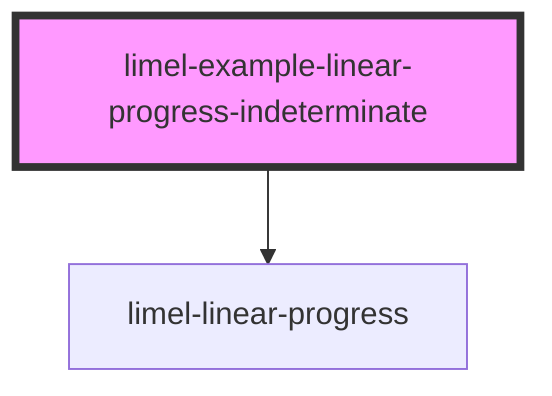

# limel-example-linear-progress-indeterminate

<!-- Auto Generated Below -->

## Overview

Indeterminate progress
The component can be put in an indeterminate state,
where the progress bar will animate without a specific value.

This is useful for instance when the progress is not known,
but the user should be aware that something is happening.

## Dependencies

### Depends on

- [limel-linear-progress](..)

### Graph

----------------------------------------------

*Built with [StencilJS](https://stenciljs.com/)*
