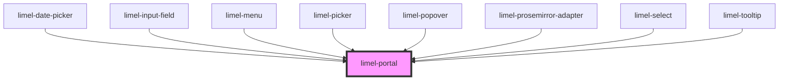

# limel-portal

<!-- Auto Generated Below -->

## Overview

The portal component provides a way to render children into a DOM node that
exist outside the DOM hierarchy of the parent component.

When the limel-portal component is used, it creates a new DOM node (a div element)
and appends it to a parent element (by default, the body of the document).
The child elements of the limel-portal are then moved from
their original location in the DOM to this new div element.

This technique is often used to overcome CSS stacking context issues,
or to render UI elements like modals, dropdowns, tooltips, etc.,
that need to visually "break out" of their container.

Using this component, we ensure that the content is always rendered in the
correct position, and never covers its own trigger, or another component
that is opened in the stacking layer. This way, we don't need to worry about
z-indexes, or other stacking context issues.

:::important
There are some caveats when using this component

1. Events might not bubble up as expected since the content is moved out to
another DOM node.
2. Any styling that is applied to content from the parent will be lost, if the
content is just another web-component it will work without any issues.
Alternatively, use the `style=""` html attribute.
3. Any component that is placed inside the container must have a style of
`max-height: inherit`. This ensures that its placement is calculated
correctly in relation to the trigger, and that it never covers its own
trigger.
4. When the node is moved in the DOM, `disconnectedCallback` and
`connectedCallback` will be invoked, so if `disconnectedCallback` is used
to do any tear-down, the appropriate setup will have to be done again on
`connectedCallback`.
:::

## Properties

| Property             | Attribute              | Description                                                                                                                                                                                               | Type                                                                                                                                                                 | Default      |
| -------------------- | ---------------------- | --------------------------------------------------------------------------------------------------------------------------------------------------------------------------------------------------------- | -------------------------------------------------------------------------------------------------------------------------------------------------------------------- | ------------ |
| `anchor`             | --                     | The element that the content should be positioned relative to. Defaults to the limel-portal element.                                                                                                      | `HTMLElement`                                                                                                                                                        | `null`       |
| `containerId`        | `container-id`         | A unique ID.                                                                                                                                                                                              | `string`                                                                                                                                                             | `undefined`  |
| `containerStyle`     | --                     | Dynamic styling that can be applied to the container holding the content.                                                                                                                                 | `object`                                                                                                                                                             | `{}`         |
| `inheritParentWidth` | `inherit-parent-width` | Used to make a dropdown have the same width as the trigger, for example in `limel-picker`.                                                                                                                | `boolean`                                                                                                                                                            | `false`      |
| `openDirection`      | `open-direction`       | Decides which direction the portal content should open.                                                                                                                                                   | `"bottom" \| "bottom-end" \| "bottom-start" \| "left" \| "left-end" \| "left-start" \| "right" \| "right-end" \| "right-start" \| "top" \| "top-end" \| "top-start"` | `'bottom'`   |
| `position`           | `position`             | Position of the content.                                                                                                                                                                                  | `"absolute" \| "fixed"`                                                                                                                                              | `'absolute'` |
| `visible`            | `visible`              | True if the content within the portal should be visible.  If the content is from within a dialog for instance, this can be set to true from false when the dialog opens to position the content properly. | `boolean`                                                                                                                                                            | `false`      |

## Slots

| Slot | Description                      |
| ---- | -------------------------------- |
|      | Content to put inside the portal |

## Dependencies

### Used by

 - [limel-date-picker](../date-picker)
 - [limel-input-field](../input-field)
 - [limel-menu](../menu)
 - [limel-picker](../picker)
 - [limel-popover](../popover)
 - [limel-prosemirror-adapter](../text-editor/prosemirror-adapter)
 - [limel-select](../select)
 - [limel-tooltip](../tooltip)

### Graph

----------------------------------------------

*Built with [StencilJS](https://stenciljs.com/)*
