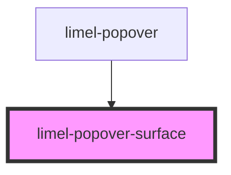

# limel-popover-surface

<!-- Auto Generated Below -->

## Properties

| Property            | Attribute | Description       | Type             | Default     |
| ------------------- | --------- | ----------------- | ---------------- | ----------- |
| `contentCollection` | --        | Content to render | `HTMLCollection` | `undefined` |

## Slots

| Slot | Description                       |
| ---- | --------------------------------- |
|      | Content to put inside the surface |

## Dependencies

### Used by

 - [limel-popover](../popover)

### Graph

----------------------------------------------

*Built with [StencilJS](https://stenciljs.com/)*
