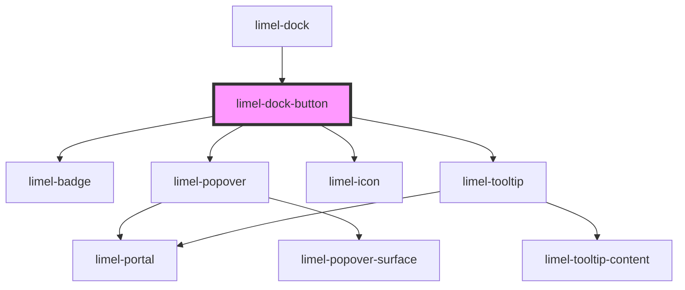

# limel-dock-button

<!-- Auto Generated Below -->

## Properties

| Property            | Attribute           | Description                                                                                             | Type       | Default     |
| ------------------- | ------------------- | ------------------------------------------------------------------------------------------------------- | ---------- | ----------- |
| `expanded`          | `expanded`          | When the dock is expanded or collapsed, dock items show labels and tooltips as suitable for the layout. | `boolean`  | `false`     |
| `item` _(required)_ | --                  | Item that is placed in the dock.                                                                        | `DockItem` | `undefined` |
| `useMobileLayout`   | `use-mobile-layout` | When dock is using mobile layout, dock items show labels and tooltips as suitable for the layout.       | `boolean`  | `false`     |

## Events

| Event          | Description                                             | Type                    |
| -------------- | ------------------------------------------------------- | ----------------------- |
| `close`        | Fired when the popover is closed.                       | `CustomEvent<void>`     |
| `itemSelected` | Fired when a dock item has been selected from the dock. | `CustomEvent<DockItem>` |
| `menuOpen`     | Fired when a dock menu is opened.                       | `CustomEvent<DockItem>` |

## Dependencies

### Used by

 - [limel-dock](..)

### Depends on

- [limel-badge](../../badge)
- [limel-popover](../../popover)
- [limel-icon](../../icon)
- [limel-tooltip](../../tooltip)

### Graph

----------------------------------------------

*Built with [StencilJS](https://stenciljs.com/)*
