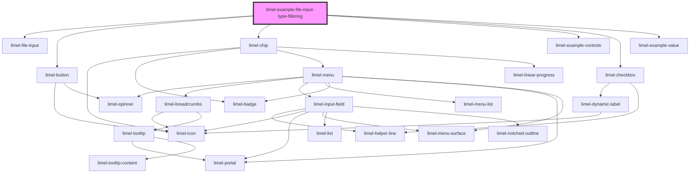

# limel-example-file-input-type-filtering

<!-- Auto Generated Below -->

## Overview

Example of a file input component with type filtering

## Dependencies

### Depends on

- [limel-file-input](..)
- [limel-button](../../button)
- [limel-chip](../../chip)
- [limel-example-controls](../../../examples)
- [limel-checkbox](../../checkbox)
- [limel-example-value](../../../examples)

### Graph

----------------------------------------------

*Built with [StencilJS](https://stenciljs.com/)*
