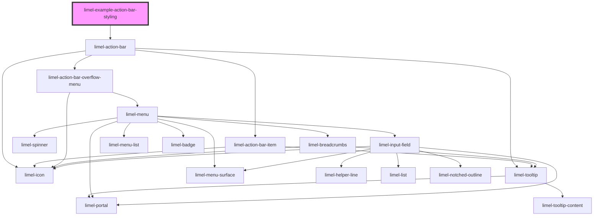

# limel-example-action-bar-styling

<!-- Auto Generated Below -->

## Overview

Styling

Using provided custom CSS properties,
it is possible to style the action bar.

:::note
The `--action-bar-item-icon-color` affects all icons.
However, the `color` specified for `icon` for individual items
will override that.
:::

## Dependencies

### Depends on

- [limel-action-bar](..)

### Graph

----------------------------------------------

*Built with [StencilJS](https://stenciljs.com/)*
