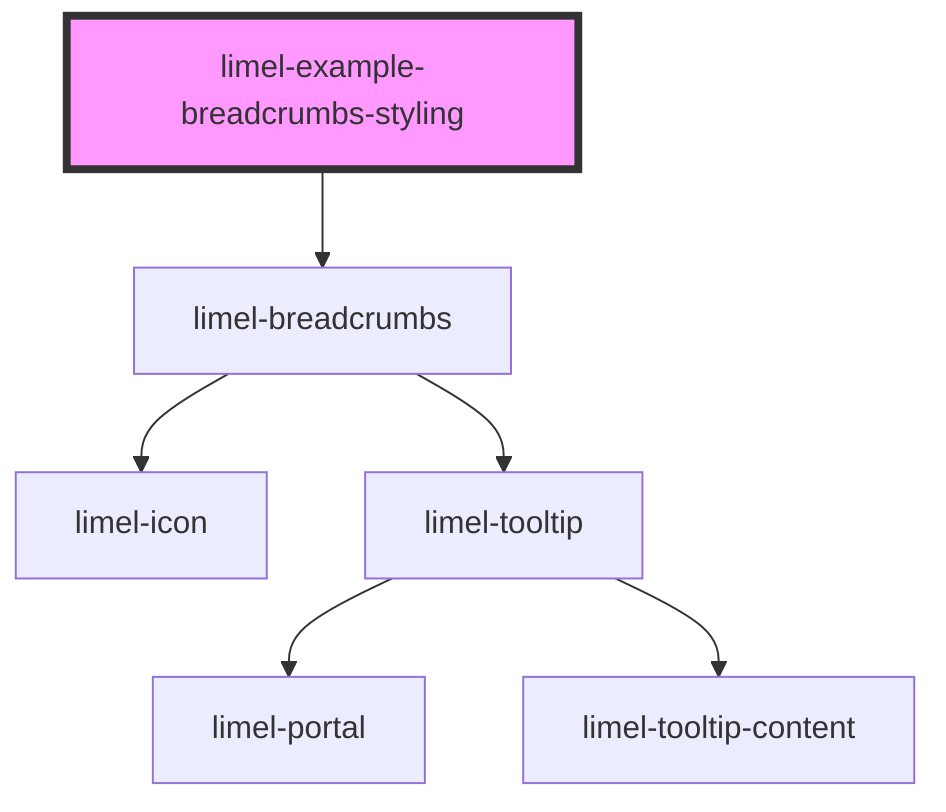

<!-- Auto Generated Below -->

## Overview

Styling

Using provided custom CSS properties,
it is possible to style the breadcrumbs.

## Dependencies

### Depends on

- [limel-breadcrumbs](..)

### Graph

----------------------------------------------

*Built with [StencilJS](https://stenciljs.com/)*
