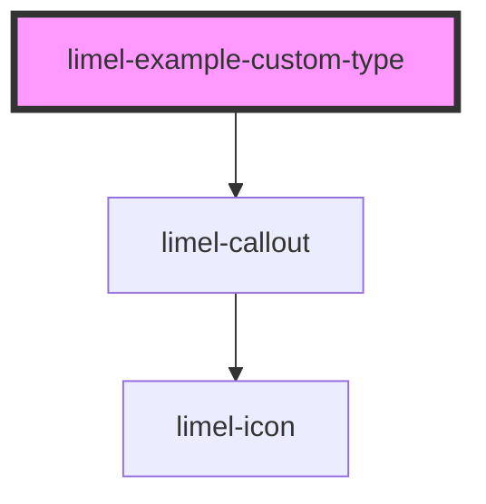

<!-- Auto Generated Below -->

## Overview

Custom type

It is possible to send in a custom type,
and provide it with custom, icon, heading and styles

## Dependencies

### Depends on

- [limel-callout](..)

### Graph

----------------------------------------------

*Built with [StencilJS](https://stenciljs.com/)*
