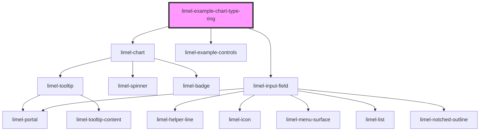

<!-- Auto Generated Below -->

## Overview

Ring chart
A ring chart is similar to a doughnut chart but used in concentric layers,
ideal for comparison of hierarchical data.

It's good for:
- Comparing multiple parts of a whole in a layered visual layout.
- Displaying hierarchical data or showing nested relationships.

:::tip
**Use:**
- When you need to show multiple data series in a single, visually appealing chart.
- For data with a clear hierarchy or grouping.

**Avoid:**
- With too many rings, as it can become visually overwhelming.
- For data that needs precise comparison across series.
:::

## Dependencies

### Depends on

- [limel-chart](..)
- [limel-example-controls](../../../examples)
- [limel-input-field](../../input-field)

### Graph

----------------------------------------------

*Built with [StencilJS](https://stenciljs.com/)*
