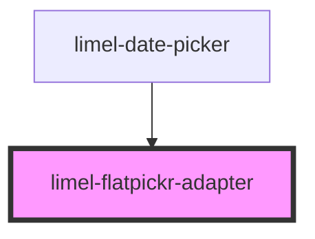

<!-- Auto Generated Below -->

## Overview

This component is internal and only supposed to be used by
the limel-date-picker. This component is needed in order for us
to render the flatpickr calendar in a portal.

## Properties

| Property                 | Attribute  | Description                                                                                                            | Type                                                                         | Default      |
| ------------------------ | ---------- | ---------------------------------------------------------------------------------------------------------------------- | ---------------------------------------------------------------------------- | ------------ |
| `format`                 | `format`   | Format to display the selected date in.                                                                                | `string`                                                                     | `undefined`  |
| `formatter` _(required)_ | --         |                                                                                                                        | `(date: Date) => string`                                                     | `undefined`  |
| `inputElement`           | --         | The native input element to use with flatpickr.                                                                        | `HTMLElement`                                                                | `undefined`  |
| `isOpen`                 | `is-open`  | Set to `true` if the calendar should be open.                                                                          | `boolean`                                                                    | `undefined`  |
| `language`               | `language` | Defines the localisation for translations and date formatting. Property `format` customizes the localized date format. | `"da" \| "de" \| "en" \| "fi" \| "fr" \| "nb" \| "nl" \| "no" \| "sv"`       | `'en'`       |
| `type`                   | `type`     | Type of date picker.                                                                                                   | `"date" \| "datetime" \| "month" \| "quarter" \| "time" \| "week" \| "year"` | `'datetime'` |
| `value`                  | --         | The value of the field.                                                                                                | `Date`                                                                       | `undefined`  |

## Events

| Event    | Description                                    | Type                |
| -------- | ---------------------------------------------- | ------------------- |
| `change` | Emitted when the date picker value is changed. | `CustomEvent<Date>` |

## Dependencies

### Used by

 - [limel-date-picker](..)

### Graph

----------------------------------------------

*Built with [StencilJS](https://stenciljs.com/)*
