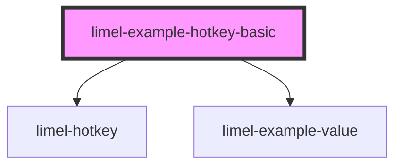

# limel-example-hotkey-basic

<!-- Auto Generated Below -->

## Overview

Basic example

The value is passed as a string, indicating which hotkey to listen for.
The component will emit an event when the hotkey is pressed.

## Dependencies

### Depends on

- [limel-hotkey](..)
- [limel-example-value](../../../examples)

### Graph

----------------------------------------------

*Built with [StencilJS](https://stenciljs.com/)*
