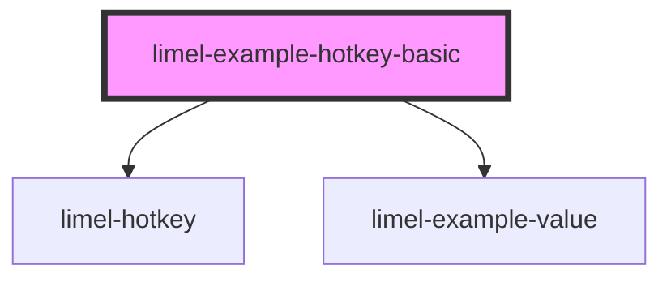

# limel-example-hotkey-basic

<!-- Auto Generated Below -->

## Overview

Basic example

The value is passed as a string, indicating which hotkey to listen for.

The component will automatically detect the operating system, and
render the hotkey accordingly, using standard glyphs to save space.

For example, the "meta" key will be rendered as <kbd>⌘</kbd> on macOS,
and as <kbd>Ctrl</kbd> on Windows. Or the "alt" key will be rendered
as <kbd>⌥</kbd> on macOS, and as <kbd>Alt</kbd> on Windows.

:::note
Consumers are encouraged to use `meta` when they want a cross-platform
"primary modifier". Even though `meta` is technically the <kbd>⊞ Win</kbd>
on Windows keyboards, here for simplicity, and based on a standard convention
for web apps it will be considered as <kbd>⌘</kbd> (Command key) on macOS,
and <kbd>Ctrl</kbd> on Windows/Linux.

- `ctrl` means “Control specifically” on all platforms.
- `cmd` or `command` are just aliases for `meta`.
:::

## Dependencies

### Depends on

- [limel-hotkey](..)
- [limel-example-value](../../../examples)

### Graph

----------------------------------------------

*Built with [StencilJS](https://stenciljs.com/)*
